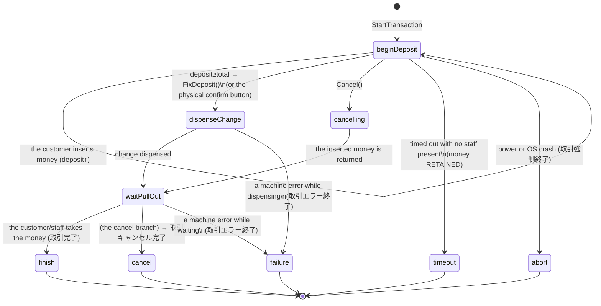

> **Tầng SỔ và ĐỐI SOÁT ở Cloud nằm ở trang khác** —
> [`cash-device-observation.md`](cash-device-observation.md). Trang này dừng ở
> "nói chuyện với máy"; ba bảng `cash_device_*`, phép đối soát ba chân, ngưỡng
> lệch theo brand và alert `cash_device_ambiguous` ở trang kia (cụm #2876).
>
> ⚠️ Câu "Cloud only registers the device, monitors it, and receives the cash
> ledger through the existing sync UP" trong summary phía trên **đã hết đúng từ
> #2878**: Cloud nay có ba bảng riêng và hai endpoint sync-UP riêng.
# 釣銭機 (Glory) adapter — design & interface

> Part of the payments cluster — the map of all twelve docs is [Payments — where to start](payments-overview.md).

> A companion to `payment-topology-and-tender-model.md` § 釣銭機. This document
> settles the **architecture** (who calls whom), the **device model** (what is
> registered in Cloud), and the **interface** (the Go client, the state machine
> and the ledger mapping) before any code is written.

---

## 0. Settled decisions (read first)

1. **The machine is NOT a payment gateway.** The `YRT-R08-MN` is a Glory hardware
   adapter exposing an **HTTP/JSON Web API** (Glory already handles the serial
   link to the 釣銭機). We only speak HTTP to that box. In money terms it stays
   `internal` plus `PaymentMethod.code = cash`. Do **NOT** add a
   `PaymentGatewayProvider = glory`, and do **NOT** add an adapter to
   `gateway_drivers`.
2. **The machine only talks on the LAN** — HTTP on **port 80, no HTTPS**, a static
   internal IP (e.g. `192.168.0.10`), with an **IP allowlist** (`TerminalACLMode`,
   wrong IP → 403) as its only security. ⇒ **Cloud can never call the machine
   directly.** The call direction is **always: a host on the same LAN → the
   釣銭機.**
3. **The host is workstation-app (Go), and only that.** A shop that wants a 釣銭機
   must run workstation-app on its LAN (even a shop whose POS is otherwise
   cloud-only). We are not building a second native agent.
4. **"Registering the device in Cloud" ≠ "Cloud can call the machine".**
   Registration gives us *identity, revenue attribution and monitoring*; the
   commands (start, dispense change) are **always issued locally by the
   workstation**, triggered by a local checkout.

---

## 0b. Two connection methods — **method A is in use**

There are **two ways** for software to drive a Glory 釣銭機:

### ✅ Method A — 簡単インターフェース (HTTP/LAN through the YRT-R08-MN) — **IN USE**

- Through the `YRT-R08-MN` adapter box: speak **HTTP/JSON** on the LAN and let
  Glory handle the serial side.
- This is the method the whole document is designed around. **Chosen for the
  current phase.**

### ⏸️ Method B — direct serial to the RT/RAD-R08 (not used, held in reserve)

- Drop the adapter box and plug a PC (usually Windows) **straight into the
  machine's RS-232C/USB serial port**, speaking **Glory's native protocol** (the
  "通信仕様書" — a DIFFERENT, lower-level document), or use the **Glory Windows
  SDK/DLL** (obtained from Glory under licence/NDA).
- **Not chosen** because (compared to A):

  | Criterion | A — HTTP/LAN (YRT-R08-MN) | B — direct serial |
  |---|---|---|
  | Connection | LAN — any host on the network can call | A physical serial cable, 1 PC : 1 machine |
  | OS | Go, cross-platform (workstation-app) | Usually locked to Windows |
  | Protocol | HTTP/JSON (this spec) | Implement the low-level serial protocol yourself |
  | Error/jam UI | Handled by the adapter's screen | Build it yourself |

- B **still needs a client running on site** (it does not escape the "LAN host"
  requirement); it only swaps the transport for a harder one. It becomes
  reasonable if a shop later **does not buy the adapter box** or needs extremely
  low serial latency — at which point **`glory.Client` is refactored onto a serial
  transport** while the state machine (§3.3-3.4) and the ledger mapping (§4) stay
  **unchanged**.

> **The current decision: method A.** Method B is kept here so that a future
> switch does not lose the context.

---

## 1. Architecture

```text
        ┌──────────────────────── Cloud (Laravel) ────────────────────────┐
        │  • Registers the 釣銭機 (a peripheral under the workstation device) │
        │  • Receives cash payments (sync UP) → recordTender(cash) + metadata │
        │  • Receives status/在高 heartbeats (sync UP) → HQ monitoring       │
        │  • NEVER calls the machine, has NO serial driver                  │
        └───────────────▲───────────────────────────────▲─────────────────┘
                        │ sync UP (device token, HTTPS)  │ heartbeat UP
                        │                                │
   ┌────────────────────┴────────────────────────────────┴─────────────────┐
   │                  workstation-app (Go, one per shop, on the LAN)        │
   │                                                                        │
   │   pos-web ──LAN──►  the local POS handler ──► CashChanger service ──┐  │
   │   (a cash checkout)                          (state machine + queue) │  │
   │                                                                      │  │
   │   writes the SQLite payment (cash, tendered, change) ◄────────────────┘  │
   └───────────────────────────────┬────────────────────────────────────────┘
                                   │ HTTP/JSON, port 80, LAN, IP allowlist
                                   ▼
                           YRT-R08-MN (the Glory adapter)
                                   │ serial (handled by Glory)
                                   ▼
                        つり銭機 RT/RAD-R08 / -300 / -380
```

**The invariants:**
- Command direction: `workstation → YRT-R08-MN`. There is no Cloud → machine
  direction.
- One 釣銭機 : one workstation : N POS terminals. The machine handles **only one
  transaction at a time** and rejects other IPs (`503 processing`). ⇒ the
  workstation **serializes** every POS (mutex/queue).
- Cloud is the **authoritative ledger**; the workstation is offline-first and
  syncs UP when the network returns. Cash is cash-flow-neutral: Cloud only records
  the correct amount, tendered and change.

---

## 2. The device model in Cloud

> **Already implemented (2026-07):** no separate `cash_changers` table was
> created — the 釣銭機 registers into the **shared `peripheral_devices` registry**
> with `type = 'coin_changer'`. The adapter's LAN address lives in the `metadata`
> JSON column: `{"url":"http://192.168.0.10"}` or
> `{"host":"192.168.0.10","port":80}`. That registry syncs DOWN to each
> workstation through `GET /api/v1/workstation/peripheral-devices` (metadata
> included, see `sync_pull_pos.go`). The workstation reads the URL **per request**
> through `(*Server).cashChangerURL()` (the most recent active `coin_changer`
> row) — so changing or replacing the machine in Cloud takes effect immediately,
> with no restart, and one `CashChangerService` keeps its session. The
> `WS_APP_CASH_CHANGER_URL` env var is now only a **dev fallback**; if both are
> empty the `/pos/cash-changer/*` endpoints return 503. The proposed table below
> was the original design and is kept for reference on what the fields mean (map
> them into `metadata` when a till or model needs adding).

The 釣銭機 registers as a **peripheral attached to an already-paired workstation
device** (no new auth device type — the workstation already holds a device token).

The proposed `cash_changers` table (or an extension of the device config):

| Column | Meaning |
|---|---|
| `id` | uuid |
| `workstation_device_id` | FK → the workstation device holding the machine |
| `branch_id`, `organization_id` | Which shop it belongs to |
| `till_id` (nullable) | The till/drawer attached to the machine (revenue attribution) |
| `model` | `RT-R08` \| `RT-RAD-300` \| `RT-RAD-380` |
| `adapter_ip` | The YRT-R08-MN's LAN IP (e.g. 192.168.0.10) — **only the workstation reads it** |
| `adapter_server_id` | `X-Server-Id` (the adapter hardware's identity, reported up by the workstation) |
| `is_active` | On/off |
| `last_seen_at`, `last_status`, `last_inventory` | Monitoring (heartbeat UP) |

- **Configuration goes DOWN** (the workstation pulls it): `adapter_ip`, `model`,
  `is_active`.
- **State goes UP** (the workstation pushes a heartbeat): `last_status`,
  `last_inventory`, `last_seen_at`, `adapter_server_id`.
- `adapter_ip` is LAN data — Cloud stores it for configuration but **never uses it
  itself** (it cannot reach the machine).

---

## 3. The Go client interface (workstation-app)

Proposed location: `workstation/internal/device/glory/` (the pure client) plus
`workstation/internal/service/cash_changer.go` (the state machine, the queue,
and the SQLite write).

### 3.1 The pure client (a 1:1 map of the Web API; it knows nothing about the ledger)

```go
package glory

// Client speaks HTTP/JSON with one YRT-R08-MN on the LAN. Pure transport — it
// never touches SQLite or the ledger. baseURL = "http://192.168.0.10" (port 80, no TLS).
type Client struct {
    baseURL string
    http    *http.Client // a short timeout for polling; longer for start/fix
}

// 4.3.1 取引開始 — POST /api/v1/transactions
type StartRequest struct {
    Total                int  `json:"total"`                // tax-inclusive, 1..9,999,999 JPY
    ShowFixDepositButton bool `json:"showFixDepositButton"` // false = we call FixDeposit ourselves
    Timeout              int  `json:"timeout"`              // seconds, 0=∞, ≤86400
}
func (c *Client) StartTransaction(ctx context.Context, r StartRequest) (transactionID string, err error)

// 4.3.2 取引取得 — GET /api/v1/transactions/{id}  (poll at ≥1s)
type Transaction struct {
    TransactionID     string `json:"transactionId"`
    TransactionStatus Status `json:"transactionStatus"`
    Total             int    `json:"total"`
    Deposit           int    `json:"deposit"`       // inserted so far
    Change            int    `json:"change"`        // change due (once fixDeposit=true)
    DispensedCash     int    `json:"dispensedCash"` // actually dispensed
    FixDeposit        bool   `json:"fixDeposit"`
    SeqNo             int64  `json:"seqNo"`         // UNIX ms; larger = newer
    StartDate         string `json:"startDate"`
    EndDate           string `json:"endDate"`
}
func (c *Client) GetTransaction(ctx context.Context, id string) (Transaction, error)

// 4.3.3 入金完了 — POST /api/v1/transactions/fix-deposit  (when showFixDepositButton=false)
func (c *Client) FixDeposit(ctx context.Context) error

// 4.3.4 取引キャンセル — POST /api/v1/transactions/cancel  (only before it is fixed)
func (c *Client) Cancel(ctx context.Context) error

// 4.3.5/4.3.6 monitoring
func (c *Client) GetStatus(ctx context.Context) (StatusInfo, error)      // 状態取得
func (c *Client) GetInventory(ctx context.Context) (Inventory, error)    // 在高取得
// 4.3.7 日時設定, 4.3.8 ログ取得 — optional, later

type Status string
const (
    StatusBeginDeposit    Status = "beginDeposit"    // taking money
    StatusDispenseChange  Status = "dispenseChange"  // dispensing change
    StatusWaitPullOut     Status = "waitPullOut"     // waiting for the customer/staff to take it
    StatusFinish          Status = "finish"          // done (terminal)
    StatusCancel          Status = "cancel"          // cancelled (terminal)
    StatusAbort           Status = "abort"           // power or OS crash (terminal)
    StatusTimeout         Status = "timeout"         // timed out, money retained (terminal)
    StatusFailure         Status = "failure"         // an error while dispensing (terminal)
)

// Glory errors: HTTP 4xx/503 plus a {title, detail} body. Map title → GloryError.
type GloryError struct {
    HTTPStatus int
    Title      string // "empty","full","busy","error","ifError","notReady",
                      // "needPullOut","recovery","setError","systemError",
                      // "impossible","processing","billRejectFull","notEnough",...
    Detail     string
}
```

### 3.2 The state machine and queue (the service)

```go
// CashChangerService: one instance per machine. Serializes every POS through one mutex/queue.
type CashChangerService struct {
    client *glory.Client
    mu     sync.Mutex // one transaction at a time — enforcing the hardware constraint
    store  *sqlite.Store
}

// Collect: called by the local POS handler on a cash checkout.
// total = the amount to collect (JPY). Returns on a terminal state (finish/cancel/timeout/...).
func (s *CashChangerService) Collect(ctx context.Context, orderID string, total int) (Result, error) {
    s.mu.Lock(); defer s.mu.Unlock()          // serialize
    id, err := s.client.StartTransaction(ctx, glory.StartRequest{
        // 300 is the default; the live value comes from the peripheral's
        // metadata.deposit_timeout_seconds (#2422) — see "Deposit timeout is
        // per shop" above.
        Total: total, ShowFixDepositButton: false, Timeout: 300,
    })
    // ... on 503 processing/busy/error → map the error and return a UX message
    for {                                       // the poll loop, ≥1s
        t, err := s.client.GetTransaction(ctx, id)
        switch t.TransactionStatus {
        case StatusBeginDeposit:
            if t.Deposit >= t.Total { s.client.FixDeposit(ctx) } // fix it → the machine dispenses change
        case StatusFinish:
            return Result{Paid: t.Total, Tendered: t.Deposit, Change: t.DispensedCash}, nil
        case StatusCancel, StatusTimeout, StatusAbort, StatusFailure:
            return Result{}, terminalError(t)
        }
        time.Sleep(1 * time.Second)             // 留意点: poll at ≥1s
    }
}
```

The mandatory points:
- **`showFixDepositButton=false`** so the software fixes the deposit itself with
  `FixDeposit` once `deposit ≥ total` — which keeps control in the POS (sequence
  5.2). (`true` relies on the physical button on the adapter's screen, and the POS
  must **not** call fix-deposit — sequence 5.1.)
- **Poll at ≥1s** (per the spec's 留意点; anything denser puts the adapter under
  high load).
- **`seqNo`** to discard stale responses when running concurrently (not needed in
  a single-threaded loop).
- **Timeout** (300s by default, configurable — see below): past it the machine
  cancels itself and **retains the money** if no staff member is present (status
  `timeout`) → staff must be alerted to deal with it.

#### Deposit timeout is per shop (#2422)

The number is `metadata.deposit_timeout_seconds` on the `coin_changer`
peripheral, editable in the admin peripheral form and in the workstation's own
Peripherals screen. **Absent = 300s**, so nothing changes for a shop that never
touches it.

| | |
|---|---|
| Bounds (Cloud, 422 outside) | **30 – 86400** seconds |
| Absent / null / out of bounds (workstation) | falls back to **300s** |
| Resolved | **per transaction**, from the synced `peripheral_devices` row — like the adapter URL, so an edit takes effect on the next sale with **no restart** |

Two asymmetries are deliberate:

- **Cloud rejects a bad value; the workstation clamps to the default.** The
  workstation sits on the sales path and reads whatever synced down — refusing
  to sell because a number looked odd would be the worse failure. Registration
  is where a human is present to read an error.
- **0 is refused even though the Glory API accepts it.** In the API 0 means "no
  timeout"; a machine that waits forever holds the customer's cash with no
  terminal state for the POS to clear. A shop wanting effectively-no-timeout
  sets 86400 (24h), which still terminates.

The workstation's async-session watchdog follows the same number
(`CashChangerService.sessionBudget()` = timeout + 2 min slack). A fixed budget
under a longer machine timeout would cancel the session while the customer is
still feeding cash in.

### 3.3 The state machine (取引 states — page 49)



**The decision table inside the poll loop** (`GET /transactions/{id}` at least
every second):

| `transactionStatus` | `fixDeposit` | What the workstation does |
|---|---|---|
| `beginDeposit` | false | If `deposit ≥ total` → call `FixDeposit()`. Otherwise keep polling |
| `beginDeposit` | true | The machine has been fixed (physical button). Wait for `dispenseChange` |
| `dispenseChange` | true | Dispensing change. Keep polling |
| `waitPullOut` | true | Dispensed, waiting to be taken. Keep polling (or treat it as done if waiting is not required) |
| `finish` | true | ✅ **Terminal — write the ledger** `paid=total, tendered=deposit, change=dispensedCash` |
| `cancel` | — | ⛔ Terminal — cancelled, **record no income** (the money was returned) |
| `timeout` | — | ⛔ Terminal — **money RETAINED**, record no income, **alert staff** |
| `abort` | — | ⛔ Terminal — power/crash, **reconcile by hand** (money may still be inside the machine) |
| `failure` | — | ⚠️ Terminal — an error while dispensing, **reconcile by hand** (see §3.4) |

### 3.4 Handling errors MID-transaction (money safety — the most important part)

A machine error mid-transaction makes `GET /transactions/{id}` respond differently
depending on **when** it happens:

| When the error occurs | The 取引取得 response | Meaning | What to do |
|---|---|---|---|
| During `beginDeposit` (not yet fixed) | **503** `title=error` | The machine jammed while taking money | Show the staff the on-machine recovery instructions. Once cleared: **keep polling** (it resumes itself) **or** call `Cancel()` (per the spec, cancel must be called AFTER clearing the error) |
| After `FixDeposit`, while dispensing | (automatic) | An error while dispensing change | Once cleared, the machine **continues by itself** — just keep polling |
| A machine error during `dispenseChange`/`waitPullOut` | **200** `status=failure` | An error at the end of the flow | **The transaction has ENDED as failure**; it cannot be cancelled |

**⚠️ The money-sensitive case — `failure` (取引エラー終了):** the customer HAS
inserted money (`deposit`), but the change may have been dispensed **only
partially**. Read `dispensedCash` from the last `GET` to see how much came out.
**Do NOT record it as `finish`.** Write a **needs-manual-reconciliation** record
(`deposit`, `dispensedCash`, and the difference) plus an alert to staff/manager so
the drawer can be reconciled. The same applies to `abort` (a power or OS crash
mid-transaction).

**`empty` (在高不足 — not enough change):** detected through
`GET /transactions/{id}` (or a 503 `empty` on start/fix). **`Cancel()` is
mandatory** → refill the change → start again. Never fix the deposit knowing the
machine cannot make change.

### 3.5 Monitoring: 状態取得 and 在高取得 (heartbeat UP)

Both APIs **work even during a transaction** — use them for the Cloud heartbeat;
they are NOT part of the transaction poll.

- **`GET /api/v1/machine/status`** → the machine's condition:
  ```json
  { "bill": {"errorCode": 0, "setInfo": 72}, "coin": {"errorCode": 0, "setInfo": 64},
    "cashStatus": {"1":"empty","5":"nearEmpty","10":"nearFull","50":"full","100":"enough",
                   "billReject":"empty","cassete":"none","overflow":"none"},
    "seqNo": 1638262502654 }
  ```
  - `bill.errorCode` / `coin.errorCode` ≠ 0 → **a machine fault** (raise an alert).
  - `setInfo` is a set of **bit flags** for doors, locks and trays (their meaning
    **differs per model**, RT/RAD-R08/-300/-380 — pages 37-38). Use them to warn
    "ユニット open / lock open / tray full".
  - `cashStatus` per denomination: `empty|nearEmpty|enough|nearFull|full` → derive
    **"running out of change"** (`nearEmpty`/`empty` on the main change
    denominations) and **"nearly full"**.
- **`GET /api/v1/machine/cash`** → 在高 (the note/coin count per denomination):
  ```json
  { "cashCount": {"cash": {"1":10,"5":20,"100":50,"10000":90}, "stock": {...}, "wrap": {...}},
    "cashErrorStatus": {"cash": {"1":false,...}, "cassette": false}, "billRejectCount": 0,
    "seqNo": 1638262502654 }
  ```
  - **Denominations at 0 are 省略 (omitted from the JSON)** → the parser must
    default to 0; a missing key is not an error.
  - `cashErrorStatus.*` means **在高不確定** (true = the count may differ from
    reality) → a reconciliation flag.
  - `billRejectCount` > 0 → the reject bin holds money and needs emptying.
  - `cashCount` is used to reconcile 在高 against the drawer ledger (it differs per
    model — pages 42-43).

Heartbeat: the workstation polls status and 在高 (every ~30-60s, respecting the
≥1s per call rule) and pushes
`{status_summary, inventory, errorCodes, billRejectCount, server_id}` to the Cloud
endpoint (§6) → the HQ dashboard then shows the machine as online / low on change
/ faulty.

### 3.6 日時設定, seqNo and logs

- **`POST /api/v1/machine/date`** `{date: ISO8601}` (2000-2037). Synchronize the
  machine's clock with the workstation at pairing and periodically. **503 while a
  transaction is in progress.**
- **`seqNo` is the adapter's UNIX ms.** ⚠️ **Setting the adapter's clock (SetDate)
  makes seqNo jump** → the app must **reset the "latest seqNo" it is holding**
  after setting the time, or it will mistake a new response for an old one.
- **`GET /logs/{YYYYMMDD}`** (⚠️ the path is `/logs/...`, **not** `/api/v1/...`) →
  a password-protected zip (24h ≈ 3MB). Only for incident investigation; not
  needed in the normal flow.

---

## 4. Mapping to the ledger (SQLite → sync UP → Cloud)

When `Collect` returns `finish`, write one local cash payment and sync it UP like
any existing workstation payment (`payment.create` →
`POST /api/v1/workstation/payments`):

| Ledger field | Source |
|---|---|
| `amount` (paid) | `total` (JPY is 0-decimal → minor == major) |
| `tendered` | `deposit` |
| `change` | `dispensedCash` (on finish) |
| `payment_method` | `cash` |
| `metadata.capture_source` | `cash_changer` |
| `metadata.device_id` | The cash_changer id |
| `metadata.glory_transaction_id` | `transactionId` (audit plus idempotency) |
| `metadata.adapter_server_id` | `X-Server-Id` |

- **Cash-flow-neutral:** Cloud's `recordTender(cash)` only records; the
  `till_session_id` is stamped through the existing shift flow, so the drawer
  reconciliation (`expected_cash`) stays correct.
- **Idempotency:** `glory_transaction_id` is the key — a sync retry cannot
  double-write.
- Cloud's **money logic does not change** (`recordTender` already exists); it only
  receives extra metadata.

---

## 5. Error taxonomy (503 title → behaviour)

| Group | title (examples) | What the workstation/POS does |
|---|---|---|
| **Busy / in progress** | `processing`, `busy`, `impossible` | Retry later, or show "the machine is busy" |
| **Needs staff action** | `needPullOut`, `full`, `billRejectFull`, `setError`, `error`, `recovery` | Show instructions (take the money, open the lock, clear the jam) then retry or cancel |
| **Not enough change** | `empty` | **Cancel** the transaction → refill the change → start again |
| **Not enough money yet** | `notEnough` (fix-deposit while deposit<total) | Wait for the customer to insert more |
| **Connectivity** | `ifError`, `notReady`, `systemError` | Report a hardware fault; never settle automatically |

The money-safety principle: **never write a `finish` ledger row** unless
`GetTransaction` returned `finish` with the right `dispensedCash`. A mid-flow
error → `cancel`/`timeout` → no income is recorded.

---

## 6. Cloud-side changes (the minimum)

1. **A model plus migration** for `cash_changers` (§2), plus a resource so HQ/admin
   can attach a machine to a workstation and a till.
2. **Config DOWN**: add cash_changers to the workstation's sync_pull DOWN matrix
   (like menus and tables) so the workstation knows the IP, model and enabled
   state.
3. **Heartbeat UP**: the endpoint
   `POST /api/v1/workstation/cash-changers/{id}/heartbeat` accepting
   `{status, inventory, server_id, seen_at}` → updates the `last_*` columns.
4. **Payment metadata**: `recordTender` accepts the `capture_source` and `glory_*`
   metadata (most of it already does; verify at implementation time).
5. **No** new gateway provider or adapter, and **no** Cloud→machine endpoint.

---

## 7. Security

- The 釣銭機 is **isolated on the LAN**; set `TerminalACLMode=1/2` so only the
  **workstation's IP** may reach it (403 for everything else). Never expose it to
  the guest Wi-Fi.
- The lack of TLS on that LAN hop is a **hardware limitation** — compensate with
  network segmentation (a dedicated POS VLAN) plus the allowlist.
- Cloud↔workstation remains HTTPS plus a device token, as today.

---

## 8. Testing (no real machine required)

- **A fake Glory server** (Go `httptest`) simulating `/api/v1/transactions*`:
  start → return an id; poll → increase `deposit` step by step → `finish`; plus
  the `503 title`, `timeout`, `cancel` and `empty` branches. Test
  `CashChangerService.Collect` end to end plus the ledger mapping plus
  serialization (two goroutines competing for one machine → the second waits).
- Test idempotency: syncing UP the same `glory_transaction_id` twice → one ledger
  row.

---

## 9. Open questions (to settle at implementation time)

- ✅ **Settled** — `showFixDepositButton=false` (the POS calls `FixDeposit`
  itself, sequence 5.2) to keep control of the UX.
- ✅ **Settled** — `empty` (not enough change) → **Cancel** then refill (§3.4).
- ✅ **The whole spec has been read** (pages 1-58): the state machine §3.3, the
  error matrix §3.4, monitoring §3.5, datetime/logs §3.6.
- 🔲 **`failure`/`abort` (manual reconciliation)**: the staff alert UX plus the
  drawer reconciliation flow when change was dispensed only partially (reading
  `dispensedCash`) — the web/pos/workstation screens need designing.
- 🔲 **Several POS terminals sharing one machine**: currently serialized with a
  mutex; should the second POS see a "waiting for the machine" indicator?
- 🔲 **A timeout that retains the money** (`timeout`, no staff present): the drawer
  reconciliation procedure.
- 🔲 **The 状態/在高 heartbeat**: the interval (30-60s), whether the "running out of
  change" threshold lives in Cloud or the workstation, and how it appears on the
  HQ dashboard.
- 🔲 **The `setInfo` bit flags per model** (R08/-300/-380 differ, pages 37-38):
  build a decode table when writing the monitoring code.
- 🔲 **Method B (serial)**: only revisit if a shop does not buy the adapter (§0b).

---

## Reference files

| Topic | Path |
|---|---|
| Payment topology (the 釣銭機 context) | `docs/guide/payment-topology-and-tender-model.md` |
| The orchestrator's recordTender | `backend/app/Services/Payment/Orchestration/PaymentOrchestrator.php` |
| Workstation local payment | `workstation/internal/handler/local_pos.go` |
| Workstation sync UP | `workstation/internal/service/sync_service.go` |
| Workstation sync pull DOWN (the matrix) | `workstation/internal/service/sync_pull.go` |
| The Glory spec (source) | [`docs/reference/vendor/glory/YRT-R08-MN-easy-interface-spec.pdf`](../reference/vendor/glory/YRT-R08-MN-easy-interface-spec.pdf) — original title: `①【簡単インターフェース仕様書】YRT-R08-MN.pdf` (IP/RAS: §3.3.2) |
