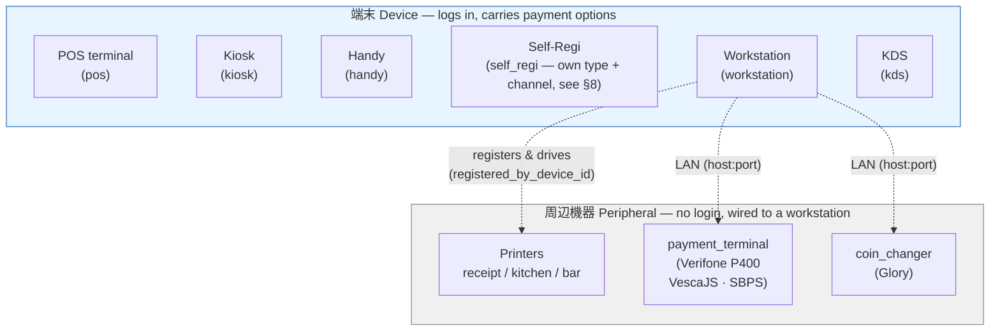
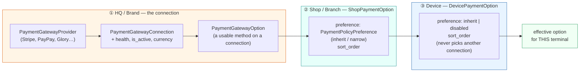
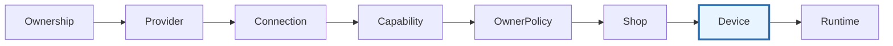
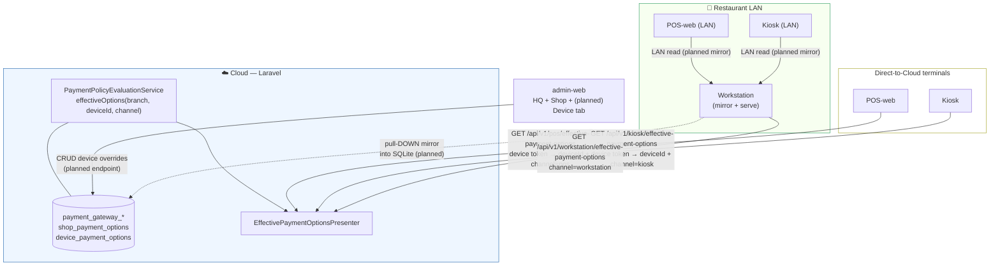
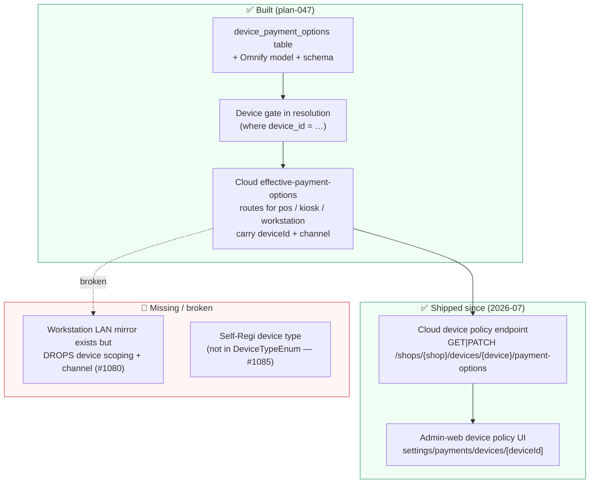

# デバイスと決済管理 — Device Taxonomy & Device-Scoped Payment Options

> Part of the payments cluster — the map of all twelve docs is [Payments — where to start](payments-overview.md).

> **Status:** architecture reference · **Audience:** backend / workstation / admin-web / pos-web / kiosk engineers
> **Scope:** (1) the two distinct "device" concepts in TempoFast, (2) how a payment
> method becomes **specific to one login terminal**, and (3) how that resolved set is
> delivered over **Cloud (direct)** and **LAN (through the workstation)**.

This document is the single source of truth for the sentence that started it:

> *"phương thức thanh toán phải được quản lý qua cloud hoặc LAN (thông qua workstation)
> để lấy phương thức thanh toán **chuyên biệt cho thiết bị** đó."*
> — payment methods must be manageable per **login terminal**, delivered via Cloud **or**
> LAN, so each terminal gets its own specialised set.

---

## 1. Two things we both call "device" — do not conflate them

TempoFast has **two disjoint hardware concepts**. They live in different tables, have
different lifecycles, and only one of them ever carries payment options.

| | **端末 Device** (login terminal) | **周辺機器 Peripheral** (ngoại vi) |
|---|---|---|
| Vietnamese | thiết bị đầu cuối | thiết bị ngoại vi |
| **Definition** | *A thing that logs in.* Authenticates to Cloud via device pairing → device token. | Hardware wired to a workstation. **Never logs in**, has no token. |
| Table | `devices` | `peripheral_devices` |
| Type | `DeviceTypeEnum` (7): `pos`, `kiosk`, `handy`, `kds`, `workstation`, `tms`, `self_regi` | `PeripheralType` (source of truth: `workstation/frontend/src/lib/api.ts`): `payment_terminal`, `coin_changer`, `receipt_printer`, `kitchen_printer`, `bar_printer` |
| Identity | Paired 6-char code → `device_token` (Sanctum) | `registered_by_device_id` — owned by the workstation that registered it |
| Examples | POS terminal, Kiosk, Handy (server handheld), Self-Regi | **máy thu tiền** thẻ (`payment_terminal` = Verifone P400 qua VescaJS / SBPS 対面), **máy đổi/thu tiền mặt** (`coin_changer` = Glory), máy in bếp/quầy/bill (`*_printer`) |
| Carries payment options? | **YES** — payment options are scoped to a *login terminal* | **NO** — a printer / changer has no notion of "payment method" |

**Rule of thumb:** if you ask *"what payment methods does this show?"* the answer only
makes sense for a **端末 Device**. A payment terminal (P400) or coin changer (Glory) is the
*hardware that executes* a card/cash payment — it is a peripheral of the terminal, not a
terminal itself.

> **Type vs role — don't confuse them.** `PeripheralType` (5 values above) is *what the
> hardware is*. **Printer role** (`hall_printer` / `kitchen_printer` / `bar_printer` /
> `receipt_printer`) is *what a printer is used for* — the print-routing lane a ticket
> takes (see `docs/guide` print routing). A `kitchen_printer` peripheral filling the
> kitchen role is the common case, but `hall_printer` (ホール = front-of-house) is a **role
> label, not a registrable `PeripheralType`**. Two of the five types —
> `payment_terminal` and `coin_changer` — are **network peripherals** and require
> `metadata.host` (`NETWORK_PERIPHERAL_TYPES` in `api.ts`); printers may be USB or TCP.

---

## 2. The payment-option data model — three narrowing layers

A payment option shown on a terminal is resolved through **three ownership layers**, each
of which can only ever **narrow** (never widen) what the layer above allows. This is the
"widening is forbidden" invariant baked into the schema.

### Layer ① HQ connection (brand-scoped)
`PaymentGatewayProvider → PaymentGatewayConnection → PaymentGatewayOption`
The actual gateway wiring + secrets + health. **What is technically possible.**

### Layer ② `ShopPaymentOption` (branch narrows)
| Column | Meaning |
|---|---|
| `organization_id`, `brand_id`, `branch_id` | tenant scope |
| `option` → PaymentGatewayOption | which HQ option this row governs |
| `connection` | pinned connection (a shop row can never re-point to another connection) |
| `preference` → `PaymentPolicyPreference` (`default: inherit`) | branch-level narrowing |
| `sort_order` | display order at the shop |
| unique `(branch_id, option_id)` | one row per option per branch |

> Schema note: *"Shop preference narrowing is allowed within tenant/branch authorization wrapper."* — a shop may only **narrow**.

### Layer ③ `DevicePaymentOption` (terminal narrows) — the device-specific layer
| Column | Meaning |
|---|---|
| `organization_id`, `branch_id` | tenant scope |
| `device` → **`devices`** (`belongsTo Device`) | the login terminal this override belongs to |
| `shop_payment_option` → ShopPaymentOption | the parent shop option it narrows |
| `preference` **Enum `[inherit, disabled]`** (`default: inherit`) | **the whole device-specific mechanism** |
| `sort_order` | per-device display order |
| `change_reason`, `version` | audit trail for overrides |
| unique `(device_id, shop_payment_option_id)` | one override per option per device |

> Schema note (hard invariant): *"Device restriction may only **inherit or disable**;
> widening is enforced in authorization service."* and *"Device can never select another
> connection."*

So a terminal's specialised set = **the shop's enabled options, minus those the device row
marks `disabled`, ordered by the device `sort_order`** (falling back to shop order). A
kiosk can hide cash; a Handy can hide invoice/on-account; a self-regi can be limited to
cashless — **without touching any other terminal.**

`preference = inherit` is the default and needs no row: **absence of a DevicePaymentOption
row = inherit the shop.** A row only exists to `disable` or to re-order.

---

## 3. Resolution pipeline — `PolicyLayer`

Every candidate option is run through an ordered gate. The first gate that rejects it
stamps the `reason` / `error_code` the UI shows. Order (from
`app/Services/Payment/Policy/Enums/PolicyLayer.php`):

| Layer | Rejects when… |
|---|---|
| **Ownership** | tenant / brand / branch mismatch |
| **Provider** | provider disabled |
| **Connection** | connection not `is_active`, or unhealthy |
| **Capability** | connection can't serve the **requesting channel** (POS vs Kiosk vs Workstation) or currency |
| **OwnerPolicy** | HQ policy revision blocks it |
| **Shop** | `ShopPaymentOption.preference` narrows it out |
| **Device** ← *the device-specific gate* | `DevicePaymentOption.preference = disabled` for **this** `device_id` |
| **Runtime** | live health / per-request failure |

Entry point: `PaymentPolicyEvaluationService::effectiveOptions(Branch $shop, ?string $deviceId, PaymentChannelEnum $channel)`
→ `EloquentPaymentPolicyCandidateLoader::loadForBranch($shop, $deviceId)` which loads
device overrides with `->where('device_id', $deviceId)->keyBy('shop_payment_option_id')`.
**The device gate is already wired in the read path** — see §5 for what remains.

`PaymentChannelEnum` = `customer_web`, `pos`, `kiosk`, `workstation`, `server_to_server`.
The channel is derived from the **requesting terminal's type** and matched at the
**Capability** layer.

---

## 4. Delivery — Cloud direct **and** LAN through the workstation

Same evaluation, two transports. A terminal gets an identical resolved set whether it is
online-to-Cloud or talking to the workstation on the LAN.

### Cloud read endpoints (per channel — already routed)
| Channel | Route | Controller |
|---|---|---|
| POS | `GET /api/v1/pos/effective-payment-options` | `PosEffectivePaymentOptionsController@index` |
| Kiosk | `GET /api/v1/kiosk/effective-payment-options` | `KioskController@effectivePaymentOptions` |
| Workstation | `GET /api/v1/workstation/effective-payment-options` | `WorkstationEffectivePaymentOptionsController@index` |

Each resolves `deviceId` from the caller's device token, passes the matching
`PaymentChannelEnum`, and returns the presenter output (option id, label, `is_active`,
`health`, `reason`, `error_code`, `device_preference`, `sort_order`).

> `GET /api/v1/pos/payment-methods` and `GET /api/v1/shops/{shop}/payment-methods` are
> **@deprecated** branch-scoped reads — they predate device scoping. New clients must use
> `effective-payment-options`.

### LAN path (workstation as gateway)
The workstation is the LAN authority for POS/Kiosk when offline-tolerant. It already
proxies unmirrored `/api/v1/pos/*` to Cloud and runs a 60s pull-DOWN sync for menu /
branch / tables. The device-scoped options ride the **same** mechanism: workstation serves
`effective-payment-options` for `channel=workstation`, and (planned, §5) mirrors the
resolved per-device sets into SQLite so a POS/Kiosk on the LAN reads them without a Cloud
round-trip during an outage.

---

## 5. What exists today vs. what's missing (implementation roadmap)

The **data model and the Cloud read path already exist** (plan-047). The gap is the
*management surface* and the *LAN mirror*.

### Roadmap

**R1 — Cloud management endpoint (backend). ✅ SHIPPED.**
`GET|PATCH /api/v1/shops/{shop}/devices/{device}/payment-options`
(`routes/api/shops/payment-policy.php` → `EffectivePaymentOptionsController@deviceIndex` /
`@deviceUpdate`). Narrow-only, same-connection invariant enforced; `inherit` is the reset.

**R2 — admin-web "Device tab" UI. ✅ SHIPPED.**
`web/admin/src/app/shop/[shopSlug]/settings/payments/devices/[deviceId]/page.tsx` +
`components/device-policy-section.tsx` / `devices-section.tsx` — per-option inherit/disable
against the device endpoint above.

**R3 — Workstation LAN mirror. ⚠️ EXISTS BUT BROKEN.**
The mirror is implemented, but the LAN read **drops device scoping and channel** — a
`DevicePaymentOption` `disabled` preference is ignored when terminals read via the
workstation. Tracked in **#1080**; until fixed, device-level restrictions are only reliable
on direct-to-Cloud reads.

**R4 — Self-Regi device type. ✅ SHIPPED (2026-07-27, #1085 Option A).**
`self_regi` is a first-class case on BOTH `DeviceTypeEnum` and `PaymentChannelEnum`.
See §8 for the decision record and what shipped.

---

## 6. Worked example

**Setup:** Brand "Sushi Co" has a Stripe connection with `card` + a Glory cash connection
with `cash`. Branch "Shibuya" enables both. Terminals: a **counter POS**, a **self-regi
kiosk**, and a **Handy**.

| Terminal | Device override rows | Effective set |
|---|---|---|
| Counter POS | *(none → inherit)* | card, cash |
| Self-Regi kiosk | `cash → disabled` (cashless self-checkout) | card |
| Handy (server handheld) | `card → disabled` (servers don't tap cards) | cash |

Nobody edited the shop or HQ config to achieve this — three `device_payment_options` rows
did it, and the counter POS is untouched. Each terminal fetches its own set from
`effective-payment-options`; the same rows resolve identically whether the fetch hits Cloud
directly or the workstation on the LAN.

---

## 7. Glossary

| Term | Meaning |
|---|---|
| **端末 / Device / đầu cuối** | A **login** terminal (token-paired): the 7 `DeviceTypeEnum` cases — pos, kiosk, handy, kds, workstation, tms, self_regi. Carries payment options. |
| **周辺機器 / Peripheral / ngoại vi** | Hardware wired to a workstation, no login. `PeripheralType` (5): `payment_terminal`, `coin_changer`, `receipt_printer`, `kitchen_printer`, `bar_printer`. |
> **P400 KHÔNG phải thiết bị Stripe trong repo này.** Mục này từng ghi
> *"Stripe P400"* ở ba chỗ. Verifone P400 đúng là có trong danh mục Stripe
> Terminal ngoài đời — nên câu sai ấy *nghe hợp lý* và sống sót lâu. Nhưng máy ở
> quầy của dự án này chạy qua **VescaJS FullFeatured-WS**, acquirer **SBPS 対面**,
> bắc cầu qua workstation (`terminal_bridge.go`, `local_pos_card_terminal.go`,
> nút "Card swipe (P400)" ở pos-web) — xem
> `docs/guide/pos-card-terminal-p400-vesca.md`.
>
> Reader của **Stripe Terminal** là **WisePOS E / Tap to Pay**, và đường đó vẫn
> fail-closed chờ certification (`payments.stripe_terminal.enabled`, #1088).
> Lẫn hai thứ này có thể dẫn tới mua nhầm phần cứng hoặc đợi nhầm smoke test.

| **payment_terminal / coin_changer** | The two **network** peripherals (need `metadata.host`): P400 executes card, Glory executes cash — *not* login terminals. |
| **Printer role** | `hall_printer` / `kitchen_printer` / `bar_printer` / `receipt_printer` — print-routing lane. A **role**, not a `PeripheralType`. |
| **PaymentGatewayOption** | HQ layer — a usable method on a gateway connection. |
| **ShopPaymentOption** | Branch layer — narrows HQ options; `PaymentPolicyPreference`. |
| **DevicePaymentOption** | **Device layer** — `inherit | disabled` per terminal; the device-specific mechanism. |
| **effective-payment-options** | The unified per-channel read endpoint returning the resolved set. |
| **PolicyLayer** | Ordered resolution gates: Ownership → Provider → Connection → Capability → OwnerPolicy → Shop → **Device** → Runtime. |

---

## 8. Recorded decisions

### Self-regi (セルフレジ) device type — Option A, IMPLEMENTED 2026-07-27 (#1085)

**Decision (2026-07-27): `self_regi` becomes a first-class case** on BOTH
`DeviceTypeEnum` and `PaymentChannelEnum` (Option A), with its own capability
matrix row. Rationale: a self-checkout register is a MONEY-COLLECTION point
(釣銭機 + card terminal, immediate settlement) while an order-taking kiosk may
be cashless-only — that is a **capability** difference the Layer-④ Capability
gate must see, not a per-terminal preference. The current workaround
(`DevicePaymentOption` rows per machine) is manual configuration standing in
for a missing device class.

**What shipped (2026-07-27, backend slice):**
- `DeviceTypeEnum::SelfRegi` + `PaymentChannelEnum::SelfRegi` (Omnify schema →
  regen across backend / admin-web / tms-app / workstation-app types).
- A self-regi device pairs and operates on the **kiosk surface**
  (`device.auth:kiosk,self_regi`) but resolves its **own channel**:
  `KioskController::channelForDevice()` maps type `self_regi` →
  `PaymentChannelEnum::SelfRegi`, and payments stamp
  `orchestrator_transport = self_regi` (own kill switch in
  `config/payments.php` `transport_switches`).
- Internal catalog: `internal.cash.v1` + `internal.card_terminal.v1` now
  certify channel `self_regi` — declared in the `channels` list of each option
  in `database/seeders/PaymentGatewayCatalogSeeder.php`, which is idempotent.
  There is **no** data migration for this; reseeding is the only path.
  `effective-payment-options` for a self-regi device lists the internal
  tenders via `PosEffectivePaymentOptionEnricher` (channel-parameterized);
  an order-taking kiosk stays policy-only.
- Converting an existing kiosk is **operator-driven, not heuristic**: there is
  no command and never a heuristic sweep — set `type: self_regi` on the device
  through device CRUD (`PUT /api/v1/hq/{brandSlug}/devices/{device}` or
  `PUT /api/v1/shops/{shopSlug}/devices/{device}`; `DeviceUpdateRequest` accepts
  any `DeviceTypeEnum` value, and the regen already carries `self_regi` into
  every client's types).
- The device-scoped LAN mirror matrix (#1080) needed no change — it keys on
  device id. Pinned by `tests/Feature/Kiosk/SelfRegiDeviceTest.php`.

**Remaining (client-side, #1085 stays open):** kiosk-app self-checkout build
sends `expected_type: self_regi` at pairing (#935 gate) + admin-web device
CRUD exposes the new type in its picker (regen already carries the enum).

---

### Related docs
- `docs/guide/payment-topology-and-tender-model.md` — tender model + payment topology
- `docs/guide/pos-card-terminal-p400-vesca.md` — P400 payment-terminal peripheral
- `docs/guide/cash-changer-glory-adapter.md` — Glory cash-changer peripheral
- `plans/plan-047/` — payment gateway + policy (the plan that shipped layers ①–③ and the device gate)
