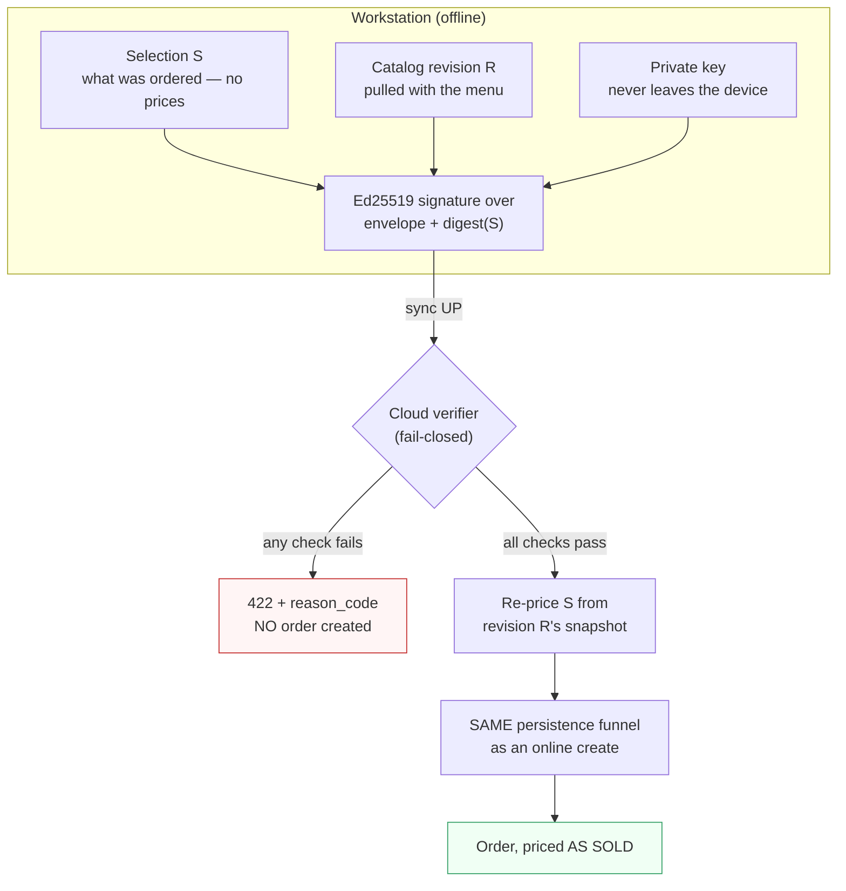

# Offline-order evidence — how Cloud decides to believe money a device took while disconnected

> Ships in epic **#1092** (issues #1093–#1097) plus **#1114** (topping prices).
> Audience: backend + workstation developers, and operators debugging a refused
> offline sync.

---

## The problem

A workstation keeps selling when the internet drops. Hours later it syncs those
orders UP. Cloud cannot simply believe the numbers: a compromised or buggy
device would be asserting how much money exists. Nor can Cloud re-price the
order from today's menu — the customer already paid yesterday's price.

## The answer in one line

**The device never asserts money.** It signs a statement of *intent*:

> "Device **D**, using key **K**, sold selection **S** against catalog revision
> **R** at time **T**."

Cloud verifies that signature, then **re-prices S itself** from revision R's
immutable snapshot using its own tax engine. A device cannot invent a price at
all — the most it can do is name a revision, and the signature binds it to
exactly one.



---

## The four moving parts

### 1. Device signing keys (#1093)

`device_signing_keys` — Ed25519 **public** keys. The device generates the pair
and registers only the public half (at pair time via `POST /devices/pair`, or
later via `POST /workstation/keys/rotate`). **The private key never leaves the
device**; Cloud can verify what a device signed but can never sign as it.

| Rule | Behaviour |
|---|---|
| Validity | Un-revoked **and** un-expired. Nothing else counts. |
| Rotation | The **old key stays valid** until its own `expires_at` — orders signed before the rotation must still verify on sync UP (grace window). |
| Revocation | Immediate **and retroactive**: a revoked key fails verification for *every* timestamp, past included. A compromised key's own clock cannot be trusted to date a signature. |
| Unpair / device revoke | Revokes **every** key of the device; the workstation also wipes its private key from disk. |

### 2. Catalog revisions (#1095, extended by #1114)

`catalog_revisions` — an immutable, **per-branch** version stamp of the
price-relevant catalog, bumped only when something that changes an offline
charge changes.

The snapshot stores the **price map**, not just a hash: a hash proves "same
catalog" but cannot validate a single line's money, which is the whole point.

**Snapshot v3:**

| Key | Contents |
|---|---|
| `lines` | `menu_product_sku_id → {sku, price, tax}` |
| `topping_items` | `topping_group_item_id → {group}` |
| `topping_groups` | `group_id → {strategy, free}` |
| `topping_prices` | `"parentProduct\|item\|toppingSku" → price` (HQ tiers: per-product override → per-SKU → NULL fallback, **resolved at snapshot time**) |
| `topping_price_overrides` | `"menuProduct\|item\|toppingSku" → price` (**SHOP tier**, #1192 — consulted FIRST, present only for menu lines a shop actually overrode) |

v1 revisions (lines only, flat map) are still readable: their menu lines price
fine, they simply cannot carry toppings — silence about toppings must never be
read as "free". v2 revisions price toppings from the HQ tiers only.

**Why the shop tier needs its own map (#1192).** Topping price resolves in
three tiers — SHOP (per menu line) → HQ per-product → HQ base — and a
product-keyed map structurally cannot express the first: two branches selling
the same product resolve *different* topping prices. The POS (Go) and the
online pricer both apply tier 1, so a snapshot carrying only the HQ answer
re-priced an offline sale LOW and the verifier refused it as tampered. Every
shop that had ever used the shop-override feature was affected.

Consequences of the shape bump:

- `catalog_revision_has_toppings` gates on **v3**, so a branch still on a v2
  revision signs no topping evidence at all (legacy path) instead of signing
  orders the verifier would reject. Run
  `php artisan catalog:rebuild-revisions` after deploy to mint v3 everywhere;
  any catalog edit does the same for one branch.
- Orders already signed against a v1/v2 revision still verify — the verifier
  reads every shape.

**Bumped by a model observer, not by service methods.** Every writer must bump
it — seeders, console commands, future endpoints, direct model writes. A writer
that silently skipped the bump would make an *honest* offline order
unverifiable. Watched: `Menu`, `MenuProduct`, `MenuProductSku`, `ProductSku`,
`ToppingGroup`, `ProductToppingGroup`, `ToppingGroupItem`,
`ToppingGroupItemSku`, `ProductToppingGroupItemOverride`,
`MenuProductToppingItemOverride` (the shop tier — added by #1192; its absence
was the second half of that bug: a shop re-pricing a topping changed what its
POS charges offline while the catalog revision stood still).

Marks flush **once per transaction, on COMMIT**:

- a multi-row menu build → **one** revision (never a half-written catalog)
- a rolled-back edit → **no** revision
- a cosmetic edit (rename a menu) → **no** revision (price map byte-identical)

### 3. The signed bytes (#1094)

**Not canonical JSON — deliberately.** The signature is produced in Go and
verified in PHP. Reproducing one language's `json_encode` byte-for-byte in
another (key order, unicode/slash escaping, float formatting) is a silent-drift
trap, and the first divergence **rejects honest orders in production** — the
worst possible failure mode for money.

Instead: a fixed-order, newline-delimited field list.

```
tempo-offline-order-v1
<device_id>              uuid
<issuer_id>              uuid
<catalog_revision>       decimal int
<issued_at>              RFC3339 UTC, second precision
<expires_at>             RFC3339 UTC, second precision
<key_id>                 uuid
<selection digest>       sha256 hex of the delimited selection form
```

Every embedded value is a uuid, decimal integer, enum token, or lowercase
sha256 hex — alphabets that **cannot contain the delimiter**. Free text (order
and line notes) is **hashed**, so a note containing a newline can never forge a
field boundary.

Both halves are pinned to the same committed fixture; a drift fails a test in
**both** repos before it can reach a device:

- `backend/tests/Fixtures/offline_signing_golden.json`
- `workstation/internal/service/testdata/offline_signing_golden.json`

#### The gate that watches the gates (#2089)

That claim was, for a while, weaker than it reads — in three ways at once, each
invisible:

1. **The PHP side excused itself.** With the workstation fixtures absent, the
   byte-comparison ran `expect(true)->toBeTrue(); return;` — reported
   **PASSED**, counted in the assertion total, for a comparison that never
   happened. Same shape in the two tax goldens.
2. **It ran on no PR.** Per-PR CI into `dev` is the `arch-gate` job
   (`tests/Unit/Arch` + `tests/Feature/Architecture`); the full suite is the
   `dev → main` promotion gate (#1516). Every parity gate lived outside both.
3. **A Go-only change triggered nothing.** `backend-tests.yml` filtered on
   `backend/**` + `schemas/**`, so a PR touching only the Go half of a parity
   pair started no run at all.

`backend/tests/Feature/Architecture/SharedFixturesAgreeTest.php` closes all
three. It **discovers** pairs (any `tests/Fixtures/*.json` with a same-named
twin in `workstation/internal/service/testdata/`) rather than listing them,
so a future gate is covered without anyone remembering to register it; it keeps
a floor on the pair count, because a scan that finds nothing looks exactly like
a scan that finds everything in order; and it tracks known **one-sided**
fixtures on a list that may only shrink.

Absence is now stated honestly rather than papered over: locally the run reports
**skipped** (`markTestSkipped`, the convention the older print-parity gates
already used), and under `CI=true` it is a **hard failure** — `workstation/` is
in-tree, so a missing fixture directory there means the checkout is broken, and
every parity claim in the repo is void until it is fixed.

Still open, tracked on #2089: `split_by_items_cases.json` has no Go-side reader,
so bill-splitting arithmetic is not yet pinned across the two engines. The Go
side never hash-compares either — nothing in the merge path compiles or runs Go
at all (#2339).

### 4. The verifier (#1096) and the wiring (#1097)

`OfflineOrderEvidenceVerifier` is the **only** class allowed to seal an offline
`TrustedOrderSnapshot` (registered in `config/domain_mutation.php`; without that
entry the authority stays fail-closed and no offline replay can be issued at
all).

`replayOffline` → verifier → `insertOfflineReplay`, which shares **one**
persistence funnel with the online create (order-code minting, till stamping,
table binding, tax/rounding snapshots, witness re-check). Forking the funnel is
how an offline order would land subtly different from the same basket sold
online — exactly what plan-047 exists to prevent.

Per-line tax delegates to the **same** calculator primitives the live resolver
uses. A second rounding engine would drift.

---

## Rejection reasons — what each one means for an operator

Every rejection is a `422` with `error_code: OFFLINE_EVIDENCE_REJECTED` and a
distinct `reason_code`, so "clock problem" is never confused with "possible
tampering". **No order is created on any of these.**

| `reason_code` | Meaning | Likely action |
|---|---|---|
| `unknown_signing_key` | Key id not registered | Re-pair the device |
| `signing_key_device_mismatch` | Key belongs to another device | Investigate — devices should not share keys |
| `signing_key_revoked` | Key was revoked (reason included) | Expected after unpair/compromise; resolve the order manually |
| `signing_key_not_valid_at_issue` | Key had not been issued (or had expired) at the claimed sale time | Check device clock; possible replay |
| `unknown_device` | Device row gone | Investigate |
| `device_branch_mismatch` | Device selling into another branch | Cross-branch mis-pair |
| `device_tenant_mismatch` | Device outside the requesting org | **Investigate — tenancy breach attempt** |
| `evidence_issued_in_future` | Dated ahead of Cloud beyond 5 min skew | Fix the device clock |
| `evidence_expired` | Past `expires_at` (device window is 60h, ceiling 72h) | Sync sooner; resolve this one manually |
| `evidence_window_too_wide` | Device granted itself > 72h | Investigate — a device cannot extend its own licence |
| `signature_invalid` | Envelope/selection altered after signing, or a different key | **Investigate — tampering or a build mismatch** |
| `unknown_catalog_revision` | Branch has no such revision | Device synced a menu Cloud never recorded; check the observer path |
| `catalog_revision_corrupt` | Stored snapshot no longer hashes true | **Investigate — the revision row was mutated in place** |
| `offline_line_absent_from_revision` | Menu line not sellable at that revision | Menu changed; resolve manually |
| `offline_menu_line_repointed` | Menu line now points at a different SKU | Catalog was restructured |
| `offline_line_not_menu_anchored` | Off-menu line — no recorded historical price | Sells through the legacy path instead |
| `offline_topping_absent_from_revision` | Topping not sellable at that revision | Topping config changed |
| `offline_topping_price_unknown` | No recorded price for that (product, item, SKU) | Refused rather than assumed zero |
| `offline_topping_group_absent_from_revision` | Group not attached at that revision | Attachment changed |
| `offline_toppings_unsupported` | Toppings against a **v1** revision | Pre-#1114 revision; legacy path |

---

## Remaining limit (fail-closed, on purpose)

**Off-menu lines** cannot be verified: the snapshot is keyed by menu line, so
there is no recorded historical price to check against. The device declines to
sign such orders, so they keep syncing through the legacy path exactly as
before — a strict improvement with zero regression.

## `price_source` on a replayed line is always `menu` (#2618)

The re-priced result Cloud persists now carries `price_source`, and for offline
replay it is **always `menu`** (`OfflineOrderEvidenceVerifier`). That is not a
default standing in for "unknown": the limit right above is the reason — an
offline line can only be verified because it anchors an **explicit menu line**
in the snapshot, and off-menu lines are declined at signing time. So a line that
reached replay at all had its price resolved from a menu entry, by definition.

**This did not touch the signed bytes.** `OrderLineEvidence` is Cloud's
*re-priced result*, not the device's payload; the signed message is built by
`OfflineOrderSigningMessage` / `SelectionWire`, and the golden fixture is
unchanged. Adding a field to the evidence value object is safe **only** while
that separation holds — if a future change moves a field into the signing
message, both repos and the golden fixture move with it.

## Deploy order

**Backend first, workstation second.** A new workstation against an old Cloud
degrades gracefully (no key issued at pair → no evidence → legacy path). The
reverse would have devices signing against a Cloud that cannot verify.
