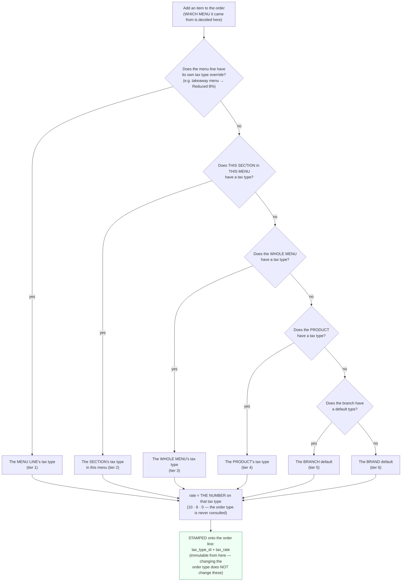
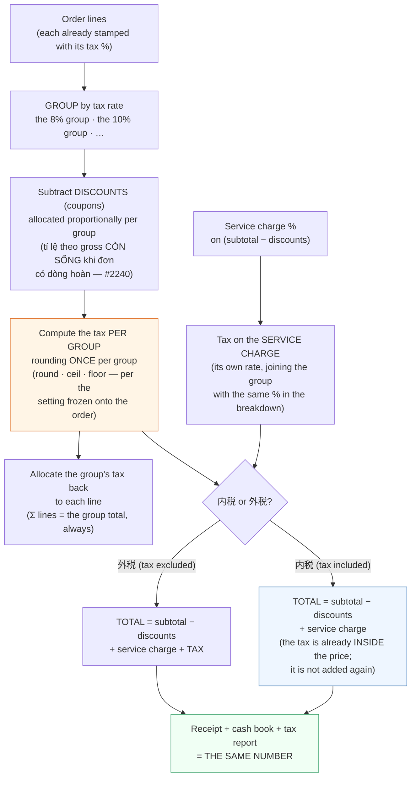

# Consumption tax — the operations handbook

> Written for **counter staff, shift leads and shop managers**. No coding
> knowledge required. The technical version for developers is
> [`tax-types.md`](tax-types.md).

---

## 1. Three core facts — knowing these covers 90% of it

1. **A tax type is ONE number**: Standard 10% · Reduced 8% · Exempt 0%. A single
   tax type never carries two rates.
2. **To sell an item at 8% for takeaway, use the takeaway MENU**: items on the
   takeaway menu carry a Reduced (8%) override. The same item on the dine-in menu
   is left alone → 10%. **The menu decides the context, not the tax type.**
3. **The system calculates everything** — what people must get right is
   **assigning the correct tax type** (on the product at HQ, and as an override on
   the takeaway menu). Alcohol is an ordinary product: assign it the Standard type
   and you are done; there is no special flag.

---

## 2. Tax rates — quick reference

Three standard tax types (each carrying exactly ONE number):

| Tax type | Rate | Used for |
|---|---|---|
| **Standard** (標準) | **10%** | Everything sold for consumption on the premises; alcohol; non-food items |
| **Reduced** (軽減) | **8%** | Food and non-alcoholic drinks **sold to take away** — assigned through an override on the takeaway MENU |
| **Exempt** (非課税) | **0%** | Brands configured as tax-exempt |

The quick memory aid (Japanese law): **only "food + non-alcoholic drinks + taken
away" qualifies for 8%** — and in this system "taken away" means **the item sits
on a takeaway menu carrying a Reduced override**. The order type (dine-in vs
takeaway) does NOT change the tax by itself.

- If the customer changes their mind midway (dine-in ↔ takeaway), the tax
  **stays** with the item as ordered. To get the correct 8%, re-order the item
  from the takeaway menu.

### Flow: how an item's tax rate is chosen



> **⚠️ THE MENU OVERRIDES THE PRODUCT — remember this (#1218)**
>
> Setting a tax type on a **whole menu**, or on **one section within a menu**,
> **overrides** the tax type assigned on the product, including a **tax-exempt
> (0%)** product. This is a settled ruling, not a bug: setting the wrong value on
> a menu is human error, whereas letting the product beat the menu would make the
> feature nearly useless — once a brand is seeded with the standard types, most
> products already have a tax type.
>
> **To keep exactly ONE item at a different rate inside a menu that has a tax
> setting**: assign a tax type to **that item's line within the menu** (tier 1) —
> it still beats everything else.
>
> **A section's value is set per menu.** The same 前菜 section appears in several
> menus; setting it to 8% in the takeaway menu does **not** affect that section in
> the dine-in menu.

---

## 3. Reading a receipt — the canonical ¥1,210 example

The shop has a **10% service charge with 10% tax on the service charge**, and menu
prices exclude tax (外税). A customer dines in and orders one ¥1,000 item:

```
Food                      ¥1,000
Service charge 10%          ¥100
Consumption tax             ¥110   ← ¥100 (tax on the item) + ¥10 (tax on the service charge)
────────────────────────────────
TOTAL                     ¥1,210
```

### Flow: from order lines to the invoice total



Three numbers must always agree: **the receipt in the customer's hand = the cash
book at shift close = the tax figure reported**. The newer order-write path has a
two-layer self-check (two engines compute independently, and a discrepancy of even
one yen refuses the write); the older paths are guarded by a 24-scenario oracle
test suite.

### Why can a new receipt differ by 1-2 yen from the old machine?

The インボイス rules require **rounding the tax ONCE for a whole group at the same
rate**, not per line:

```
WRONG (per line):  3 items × round(¥333 × 8% = 26.64 → 27) = ¥81
RIGHT (per group): round(¥999 × 8% = 79.92)                = ¥80
```

The old machine computed the "WRONG" way in some places. The new number is the
legally correct one — **not a bug**, do not adjust it by hand.

---

## 4. 内税 or 外税 — what "price includes tax" means

Each branch's `prices_include_tax` setting decides how menu prices are read:

| | 外税 (OFF — the default) | 内税 (ON) |
|---|---|---|
| A menu price of ¥1,100 means | Tax excluded → the customer pays **¥1,210** | Tax included → the customer pays exactly **¥1,100** |
| The "tax" line on the receipt | Added to the total | Informational only (the ¥100 is *inside* the price) |

⚠️ **Never** add tax again on top of a 内税 order — that charges the customer
twice. The system blocks it, but the explanation given to a customer must be
right too.

---

## 5. Who configures what, and where

### HQ (brand management)

| Task | Screen | Notes |
|---|---|---|
| Create/edit tax types (標準・軽減・非課税) | HQ › Catalog › Tax Types | Each type carries exactly **1 number** (10 · 8 · 0). Each brand has exactly **1 default type**. Never delete a type in use — deactivate it instead |
| Assign a tax type to a product | HQ › Product | The product's BASE rate (usually Standard 10%). Left blank = use the branch/brand default |
| **Takeaway menu → 8% (whole menu)** | HQ › Takeaway menu › the MENU's tax type button | **The fastest way to produce 8% takeaway**: one action for the entire menu. ⚠️ It overrides the products' tax types, **including 0% products** |
| Set the tax for **one section** in a menu | HQ › Menu › the section heading | Applies only within **this menu** — the same section in another menu is unaffected |
| Override **one item** in a menu | HQ › Menu › the item line | Beats both the section and the menu. **This is the escape hatch** when one item must stay at a different rate inside a menu that has a tax setting |
| Alcoholic items | HQ › Product | Assign the STANDARD type like any other product — there is no special flag and no enforcement mechanism; assigning it wrongly means charging wrongly |

### Shop manager (Shop Settings › 税)

| Setting | Meaning | Operational note |
|---|---|---|
| Default tax type | Applied to products with no type of their own | Must belong to the same brand and be active |
| `prices_include_tax` (内税/外税) | See section 4 | ⚠️ **Blocked while any shift is open** — close every shift before changing it (otherwise the shift report cannot balance) |
| Service-charge tax (%) | A separate rate for the service charge | Independent of the item tax |
| Tax rounding mode | `round` (normal) / `ceil` (up) / `floor` (down) | **Frozen onto each order at creation** — changing the setting does not affect existing orders |
| Print the tax breakdown on the shift-close slip | Toggles the per-rate tax block on the thermal print | The Z-report PDF always includes it and cannot be turned off |

---

## 5b. The business day is the SHOP's clock (#1091)

Every "per day" number — a shift's business date, the shift-close slip, today's
revenue, material expiry dates, menu/promotion windows — is computed in the
**branch's timezone** (`branches.timezone`), **not** the server's clock and
**not** the clock of whoever is looking.

Which means:

- A manager in Hanoi opening a Tokyo branch's shift-close slip sees the **correct
  Tokyo business day**, not the Hanoi day.
- At the same moment, the Tokyo branch may already be on the next day while the
  Hanoi branch is still on the previous one — **that is correct**, because the two
  countries are two hours apart.
- A shift opened at 8:00 on a Saturday morning in Tokyo is a **Saturday** shift.
  (Before 2026-07-27 the system recorded it as **Friday** — every shift opened
  between 00:00 and 09:00 JST, nine hours of every day, landed on the wrong day
  and dragged the shift-close slip with it; fixed in #1091.)

If a "today" report is off by one day compared to the shop's reality, that is a
bug — report it, do not adjust it by hand.

---

## 6. Things that must never be forgotten

1. **Editing a tax rate does NOT change existing orders.** The tax is "stamped"
   onto each order line the moment the item is added. Receipts, reports and closed
   shifts are immutable. That is why editing a rate mid-shift **is allowed**
   (though it is better done outside opening hours).
2. **Switching 内税/外税 mid-shift is NOT allowed** — the system returns
   `TAX_MODE_CHANGE_BLOCKED_OPEN_SHIFT`. Close every shift first.
3. **Changing the order type (dine-in ↔ takeaway) does NOT change the tax** (since
   2026-07-26). The tax follows the MENU ITEM as ordered. A customer who switches
   to takeaway and needs the correct 8% must re-order from the takeaway menu.
4. **A wrongly assigned tax type means charging the wrong amount** — the system
   does NOT correct it and does NOT warn. Review the catalog and the takeaway
   menu with your 税理士 before opening and after every menu change.
5. **A combo containing alcohol** is taxed by the type ASSIGNED TO THE COMBO. To
   put that combo at 10%, assign the standard type to the combo itself.
6. **The gap between "the order's total tax" and "the sum of the per-line tax"**
   is exactly the **tax on the service charge** — because the service charge
   belongs to no item line. Any other difference is a bug; report it.
7. A brand that wants "tax as a display label only" (entering final prices and
   handling tax outside the system) can run `catalog:tax-exempt-brand`, which
   moves the whole catalog to 0% — **prices do not change by a single yen**, only
   the labelling does.

---

## 7. Frequently asked questions at the counter

**A customer asks: why is a takeaway beer still 10% while orange juice is 8%?**
→ 酒税法: alcoholic drinks do not qualify for the reduced rate — beer is assigned
the STANDARD type (10%) even on the takeaway menu, while orange juice on the
takeaway menu carries the Reduced (8%) override.

**A cashier asks: which menu do I get for each order type on the POS?** (#1745)
→ The order type picks the menu list for you. **Nhanh (spot)** and **Tại chỗ
(dine-in)** both show the dine-in menus; **Mang đi (takeaway)** shows the takeaway
menus. Menus marked `Both` show up under every order type. So when a counter
customer is taking the food away, choose **Mang đi** — not Nhanh — or the sale is
rung up at 10% instead of 8%, and that cannot be corrected afterwards by changing
the order type (the rate is stamped on the line when the item is added).

**A manager asks: I set the order types up but the menu list looks identical.**
→ Read the badge on each row of the POS menu dropdown (#1756): イートイン /
Tại chỗ, テイクアウト / Mang đi, hoặc 両方 / Cả hai. A menu badged `Both`
deliberately appears for every order type; if most menus are `Both`, the split
has nothing to act on. The gate can only separate menus that HQ has actually
marked `DineIn` or `Takeaway` (HQ › Menus is where that is set).

**No badge at all on a row?** Then the server did not state a service type —
a Cloud backend or a workstation mirror older than #1756. The POS deliberately
shows nothing rather than guessing `Both`, because the badge is a claim about
which rate the line will take. Deploy backend, and re-sync the workstation's
menu catalog.

**A customer asks: why was this item taxed differently yesterday?**
→ First check WHICH MENU the item was ordered from (the takeaway menu has an 8%
override; the dine-in menu does not). If it is the same menu but a different tax:
HQ has just changed the configuration; the old order keeping the old number is
CORRECT (it is immutable), and new orders follow the new one.

**A cashier asks: the total tax on the shift-close slip does not match adding up
the receipts by hand?**
→ Adding up by hand easily falls into the per-line rounding trap. The shift-close
slip sums the **numbers stamped on each line** (already allocated correctly) — the
machine's number is the right one.

**A manager asks: can I change the rounding mode from round to floor?**
→ Yes, at any time in Shop Settings, and it applies only to **orders created after
the change**. Orders already open keep their own mode.

---

*Updated 2026-07-26 — matches the state of plan-043 + plan-045 + plan-047 on the
dev branch. The example figures come from the oracle test suite
(`OrderPricingOracleTest`) — if this document and the system disagree, the system
plus its tests are the truth; ask a developer to fix the document.*
