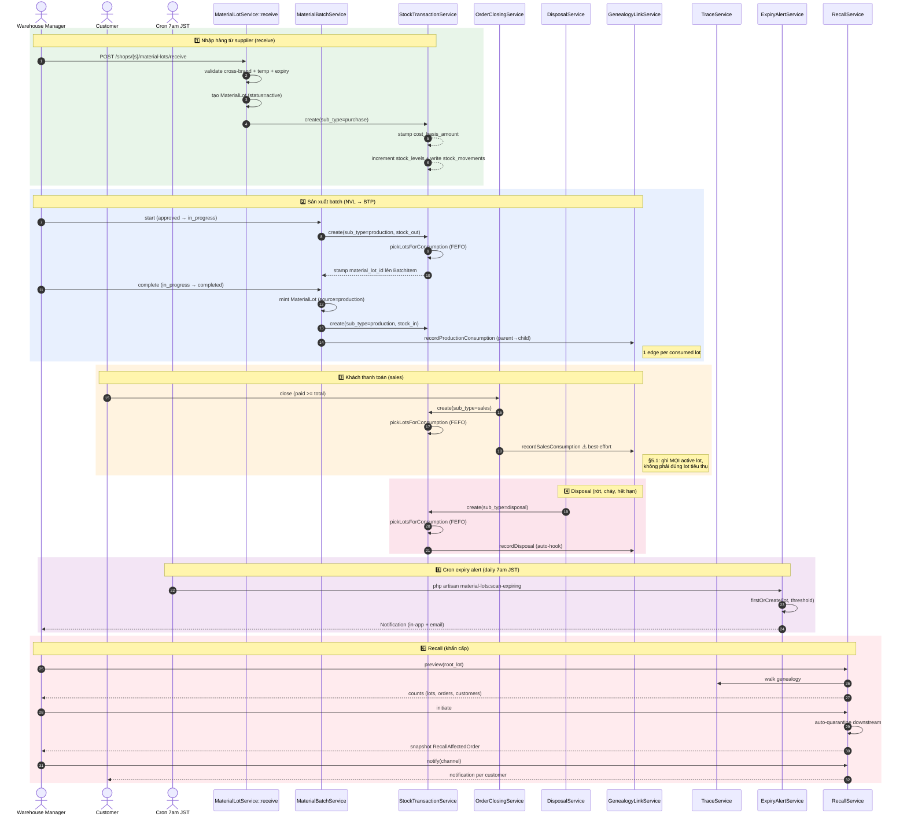
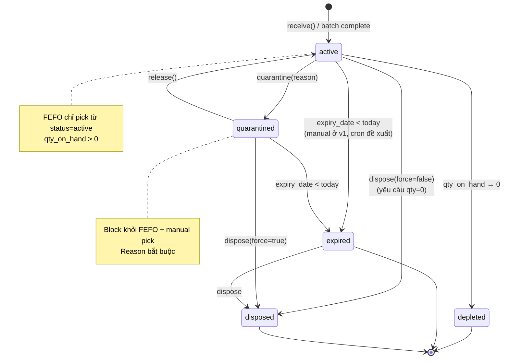
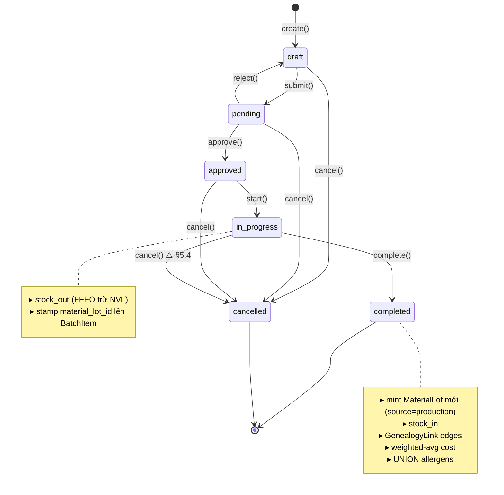

# Material / Batch / Lot / Recipe / Stock — Deep Dive

> Tổng hợp toàn bộ kiến trúc dữ liệu & nghiệp vụ của khối **Material Management**
> sau khi plan-017 (đã archive — xem git history) đã ship và plan-018 (đã archive — xem git history)
> còn ở `draft`. Mục tiêu: làm rõ luồng, chỉ ra các điểm bất nhất giữa
> README / DESIGN / code thực tế, và đề xuất công việc bổ sung kèm lý do.

Đọc cùng với:
- plan-017 README (đã archive — xem git history) — scope đã ship
- plan-017 DESIGN (đã archive — xem git history) — schema diff + decisions
- plan-017 REVIEW (đã archive — xem git history) — code review trước khi merge
- plan-018 README (đã archive — xem git history) — Phase 2 enhancements (chưa start)

---

## 0. Bức tranh tổng

> Phần này có 8 góc nhìn khác nhau để bạn có thể bám tuỳ tình huống:
> 0.1 sơ đồ 4 lớp · 0.2 service interaction (sequence) · 0.3 lifecycle Lot ·
> 0.4 lifecycle Batch · 0.5 stock ledger 3 cache · 0.6 thuật toán FEFO ·
> 0.7 ví dụ genealogy · 0.8 cheat-sheet operation → table mutation.

### 0.1 Sơ đồ tổng — 4 lớp

```
╔═══════════════════════════════════════════════════════════════════════════════╗
║                         LAYER 1 — MASTER DATA (HQ)                            ║
╠═══════════════════════════════════════════════════════════════════════════════╣
║                                                                               ║
║    ┌──────────────┐      ┌──────────────┐      ┌──────────────┐               ║
║    │  Allergen    │◄────►│  Material    │◄────►│ MaterialUnit │               ║
║    │  (M2M)       │      │              │  1:N │  (g↔kg)      │               ║
║    └──────────────┘      │  + sku       │      └──────────────┘               ║
║                          │  + components│                                     ║
║                          │  + yield_qty │      ┌──────────────┐               ║
║                          │  + temp_ccp  │◄────►│   Recipe     │               ║
║                          │  + expiry_   │  1:N │              │               ║
║                          │    thresholds│      │ + ingredients│               ║
║                          └──────┬───────┘      │ + allergen_  │               ║
║                                 │              │   rollup     │               ║
║                                 │              │ + approval_  │               ║
║                                 │              │   workflow   │               ║
║                                 │              └──────┬───────┘               ║
║                                 │                     │ 1:1                   ║
║                                 │                     ▼                       ║
║                                 │              ┌──────────────┐               ║
║                                 │              │  ProductSku  │               ║
║                                 │              └──────────────┘               ║
║                                 │                                             ║
╚═════════════════════════════════╪═════════════════════════════════════════════╝
                                  │
                  ┌───────────────┼───────────────┐
   "consumed by"  │   "produces"  │  "snapshots"  │
                  ▼               ▼               ▼

╔═══════════════════════════════════════════════════════════════════════════════╗
║                       LAYER 2 — LOT IDENTITY (Shop)                           ║
╠═══════════════════════════════════════════════════════════════════════════════╣
║                                                                               ║
║                              ┌────────────────┐                               ║
║                              │  MaterialLot   │                               ║
║          ┌──────────────────►│ ──────────────│◄──────────────┐                ║
║          │     source=       │ + lot_code     │   source=    │                ║
║          │     inbound       │ + status (FSM) │   production │                ║
║          │                   │ + qty_on_hand  │              │                ║
║          │                   │ + expiry_date  │              │                ║
║   ┌──────┴──────┐            │ + supplier     │       ┌──────┴──────┐         ║
║   │  Warehouse  │◄───────────┤ + unit_cost    │       │MaterialBatch│         ║
║   │             │  warehouse │ + currency     │ produced_by_batch_id          ║
║   │ + branch_id │            │ + temperature  │       │ + batch_code│         ║
║   │ + auto_     │            │ + effective_   │       │ + multiplier│         ║
║   │   approve   │            │   allergens    │       │ + status FSM│         ║
║   └─────────────┘            │ + cost_basis   │       │ + actual_   │         ║
║                              └────────┬───────┘       │   yield     │         ║
║                                       │               │ + output_   │         ║
║                                       │               │   lot_id ───┘         ║
║                                       │               └──────┬──────┘         ║
║                                       │                      │ 1:N            ║
║                                       │                      ▼                ║
║                                       │             ┌──────────────────┐      ║
║                                       │             │ MaterialBatchItem│      ║
║                                       │             │ + material_lot_id│      ║
║                                       │             │ + planned_qty    │      ║
║                                       │             │ + actual_qty     │      ║
║                                       │             └──────────────────┘      ║
║                                       │                                       ║
╚═══════════════════════════════════════╪═══════════════════════════════════════╝
                                        │
              ┌─────────────────────────┼─────────────────────────┐
              ▼                         ▼                         ▼

╔═══════════════════════════════════════════════════════════════════════════════╗
║                    LAYER 3 — STOCK LEDGER (3 cache đồng bộ)                   ║
╠═══════════════════════════════════════════════════════════════════════════════╣
║                                                                               ║
║   ┌────────────────────────┐    ┌───────────────────────────┐                 ║
║   │  StockTransaction      │    │  StockTransactionItem     │                 ║
║   │  (header — workflow)   │1:N │  (line — 1 row / lot)     │                 ║
║   │                        │───►│                           │                 ║
║   │ + type (in/out)        │    │ + material_id             │                 ║
║   │ + sub_type             │    │ + product_sku_id          │                 ║
║   │   purchase/sales/      │    │ + material_lot_id ────────┐                 ║
║   │   production/disposal/ │    │ + cost_basis_amount       │                 ║
║   │   transfer/adjustment  │    │ + quantity                │                 ║
║   │ + status FSM           │    └───────────────────────────┘                 ║
║   │ + reference_type/id    │                                │                 ║
║   │   (polymorphic)        │                                │                 ║
║   └───────────┬────────────┘                                │                 ║
║               │                                             │                 ║
║               │           ┌────────────────────────┐        │                 ║
║               │ writes    │   StockMovement        │        │                 ║
║               │           │ ─────────────────────  │        │                 ║
║               ├──────────►│  + material_lot_id     │ append-only ledger       ║
║               │           │  + delta (+/-)         │ (audit, không xoá)       ║
║               │           │  + timestamp           │        │                 ║
║               │           └────────────────────────┘        │                 ║
║               │                                             │                 ║
║               │           ┌────────────────────────┐        │                 ║
║               │ updates   │   StockLevel           │ ◄──────┘                 ║
║               └──────────►│ ─────────────────────  │  cache real-time qty     ║
║                           │  + warehouse_id        │  unique:                 ║
║                           │  + material_id         │  (warehouse, material,   ║
║                           │  + material_lot_id     │   lot) — MySQL 8 NULL    ║
║                           │  + quantity            │  ok cho legacy stock     ║
║                           │  + min/max/alert       │                          ║
║                           └────────────────────────┘                          ║
║                                                                               ║
╚═══════════════════════════════════════════════════════════════════════════════╝
                                        │
                                        │ (lot_id chuyền xuống)
                                        ▼

╔═══════════════════════════════════════════════════════════════════════════════╗
║              LAYER 4 — TRACE + COMPLIANCE (đỉnh giá trị nghiệp vụ)            ║
╠═══════════════════════════════════════════════════════════════════════════════╣
║                                                                               ║
║   ┌─────────────────────────────────────────────────────────────────────┐     ║
║   │                    GenealogyLink (đồ thị có hướng)                  │     ║
║   │                                                                     │     ║
║   │    parent_lot_id ─────► child_lot_id   (production edge)            │     ║
║   │    parent_lot_id ─────► customer_order_id  (sales edge, child=NULL) │     ║
║   │                                                                     │     ║
║   │    + qty_consumed                                                   │     ║
║   │    + source_event_type ∈ {material_batch, customer_order,           │     ║
║   │                            disposal, manual_adjustment}             │     ║
║   │    + source_event_id                                                │     ║
║   │                                                                     │     ║
║   │    INDEX bidirectional → walk forward + backward                    │     ║
║   │    APPEND-ONLY (Arch test cấm UPDATE/DELETE)                        │     ║
║   └─────────────────────────────────────────────────────────────────────┘     ║
║                                  │                                            ║
║                ┌─────────────────┼─────────────────┐                          ║
║                ▼                 ▼                 ▼                          ║
║       ┌──────────────┐  ┌──────────────┐  ┌──────────────┐                    ║
║       │ TraceService │  │ RecallService│  │ ExpiryAlert  │                    ║
║       │              │  │              │  │  Service     │                    ║
║       │ forward +    │  │ preview →    │  │ cron 7am JST │                    ║
║       │ backward     │  │ initiate →   │  │ idempotent   │                    ║
║       │ recursive    │  │ notify →     │  │ per (lot,    │                    ║
║       │ walk         │  │ complete     │  │  threshold)  │                    ║
║       │ depth=6/12   │  │              │  │              │                    ║
║       └──────────────┘  └──────┬───────┘  └──────────────┘                    ║
║                                │                                              ║
║                                ▼                                              ║
║                       ┌──────────────────────┐                                ║
║                       │  Recall              │                                ║
║                       │   + RecallAffected   │                                ║
║                       │     Order (join)     │                                ║
║                       │   + status FSM       │                                ║
║                       │   + FSMA-204 report  │                                ║
║                       └──────────────────────┘                                ║
║                                                                               ║
╚═══════════════════════════════════════════════════════════════════════════════╝
```

### 0.2 Service interaction — sequence diagram



### 0.3 Lifecycle — `MaterialLot`



### 0.4 Lifecycle — `MaterialBatch`



### 0.5 Stock ledger — 3 cache đồng bộ trong 1 transaction

```
              Một event consumption (vd FEFO trừ 5kg lot L-001)
                                  │
              ┌───────────────────┼───────────────────┐
              │                   │                   │
              ▼                   ▼                   ▼
    ╔═══════════════╗    ╔══════════════════╗    ╔══════════════════╗
    ║ MaterialLot   ║    ║   StockLevel     ║    ║  StockMovement   ║
    ║               ║    ║                  ║    ║                  ║
    ║  qty_on_hand  ║    ║  quantity        ║    ║  delta = -5      ║
    ║  100 → 95     ║    ║  (kho, mat, lot) ║    ║  timestamp       ║
    ║               ║    ║   100 → 95       ║    ║  material_lot_id │
    ╚═══════════════╝    ╚══════════════════╝    ╚══════════════════╝
        ▲ projection         ▲ projection             ▲ append-only
        │ cho FEFO            │ cho cross-cutting       │ ledger / audit
        │                     │ query
        │                     │
        └─────────────────────┴── đều update trong cùng DB::transaction
                                  qua StockTransactionService
                                  (single entry point)

  ⚠️ Quy tắc cốt lõi: KHÔNG BAO GIỜ update qty_on_hand hoặc quantity trực tiếp.
     Phải đi qua StockTransactionService.create() để cả 3 cache đồng bộ.
```

### 0.6 FEFO — thuật toán pick lot

```
                  Yêu cầu: stock_out 12kg flour ở warehouse A
                                     │
                                     ▼
          ╔═════════════════════════════════════════════════╗
          ║  SELECT * FROM material_lots                    ║
          ║  WHERE material_id = flour                      ║
          ║    AND warehouse_id = A                         ║
          ║    AND status = 'active'                        ║
          ║    AND qty_on_hand > 0                          ║
          ║  ORDER BY expiry_date ASC,    ◄─ ưu tiên 1      ║
          ║           received_at ASC,    ◄─ tie-break 2    ║
          ║           id ASC              ◄─ deterministic  ║
          ║  FOR UPDATE                   ◄─ lock           ║
          ╚═════════════════════════════════════════════════╝
                                     │
                                     ▼
          Active lot pool (đã sort):
          ┌────────────────┬─────────┬───────────┬──────────┐
          │ lot_code       │ expiry  │ received  │ qty      │
          ├────────────────┼─────────┼───────────┼──────────┤
          │ L-FLOUR-…-001 │ 03-15   │ 02-20     │  5 kg    │ ← pick hết
          │ L-FLOUR-…-002 │ 04-10   │ 03-01     │  8 kg    │ ← pick 7/8
          │ L-FLOUR-…-003 │ 05-20   │ 04-15     │ 10 kg    │   skip (đủ)
          └────────────────┴─────────┴───────────┴──────────┘
                              │
                              ▼ Allocation (greedy)
          ┌─────────────────────────────────────────────┐
          │  Picks:                                     │
          │   - L-…-001:  5 kg  (lot decrement → 0)     │
          │   - L-…-002:  7 kg  (lot decrement 8 → 1)   │
          │   Total: 12 kg ✓                            │
          └─────────────────────────────────────────────┘
                              │
                              ▼
              Input 1 line item → SPLIT thành 2 row
              ╔═════════════════════════════════╗
              ║  StockTransactionItem[0]:        ║
              ║   material_lot_id = L-…-001     ║
              ║   qty = 5,  cost_basis = ¥…     ║
              ║  StockTransactionItem[1]:        ║
              ║   material_lot_id = L-…-002     ║
              ║   qty = 7,  cost_basis = ¥…     ║
              ╚═════════════════════════════════╝

  Manual override: caller truyền material_lot_id → bypass FEFO trên line đó
                   (lot không 'active' → reject 422)

  Fallback legacy: nếu lot-tracked không đủ → ăn tiếp từ bucket
                   (warehouse_id, material_id, NULL) — pre-plan-017 stock
```

### 0.7 Genealogy — ví dụ trace 2-level

```
                  SUPPLIER LOTS (source=inbound)
                  ┌──────────┐ ┌──────────┐ ┌──────────┐
                  │ L-PEA    │ │ L-NOODL  │ │ L-SAUCE  │
                  │ -001     │ │ -002     │ │ -003     │
                  │ supplier:│ │ supplier:│ │ supplier:│
                  │  日本食品 │ │  日清    │ │  カゴメ  │
                  └─────┬────┘ └─────┬────┘ └─────┬────┘
                        │            │            │
                        │ consumed   │ consumed   │ consumed
                        │ by batch   │ by batch   │ by batch
                        │ MB-…-001   │ MB-…-001   │ MB-…-001
                        ▼            ▼            ▼
                     ┌─────────────────────────────────┐
                     │  GenealogyLink (production)     │
                     │  source_event_type=material_batch│
                     │  source_event_id=MB-…-001       │
                     └────────────────┬────────────────┘
                                      │
                                      ▼
                  PRODUCTION LOT (source=production)
                  ┌────────────────────────────────────┐
                  │  L-PADTHAI-BASE-…-A                │
                  │  produced_by_batch_id=MB-…-001     │
                  │  effective_allergens=              │
                  │    UNION(peanut, gluten, soy)      │
                  │  unit_cost=weighted_avg(parents)   │
                  └─────────────┬──────────────────────┘
                                │
                                │ consumed by close
                                │ order #1234
                                ▼
                     ┌──────────────────────────────────┐
                     │  GenealogyLink (sales)           │
                     │  parent_lot=L-PADTHAI-BASE-…-A   │
                     │  child_lot=NULL                  │
                     │  customer_order_id=#1234         │
                     │  source_event_type=customer_order│
                     └──────────────────────────────────┘

  FORWARD TRACE (từ L-PEA-001):
    L-PEA-001 ──► L-PADTHAI-BASE-…-A ──► order #1234

  BACKWARD TRACE (từ order #1234):
    order #1234 ◄── L-PADTHAI-BASE-…-A ◄── (L-PEA-001, L-NOODL-002, L-SAUCE-003)

  RECALL kích hoạt từ L-PEA-001 (vd nhiễm khuẩn):
    1. Quarantine L-PEA-001
    2. Walk forward → L-PADTHAI-BASE-…-A cũng quarantine
    3. Walk forward tiếp → snapshot order #1234 vào RecallAffectedOrder
    4. Notify customer của order #1234
```

### 0.8 Cheat-sheet — operation → table mutation

Bảng đọc nhanh khi debug "tại sao bảng X chưa update":

| Operation | Trigger | MaterialLot | MaterialBatch | StockTransaction | StockLevel | StockMovement | GenealogyLink |
|---|---|:---:|:---:|:---:|:---:|:---:|:---:|
| **Receive** (supplier) | `POST /receive` | INS (active) | — | INS purchase, stock_in | +qty | INS (+) | — |
| **Batch start** | `PUT /batches/{id}` approve→in_progress | UPD qty_on_hand | UPD status | INS production, stock_out | −qty | INS (−) | — |
| **Batch complete** | `PUT /batches/{id}` in_progress→completed | INS new (production) output lot | UPD status + output_lot_id | INS production, stock_in | +qty (output) | INS (+) | INS N edges (production) |
| **Order close** (paid) | `OrderClosingService::close` | UPD qty_on_hand (FEFO) | — | INS sales, stock_out | −qty | INS (−) | INS N edges (customer_order) ⚠️ |
| **Disposal** | `DisposalService::dispose` | UPD qty_on_hand (FEFO) | — | INS disposal, stock_out | −qty | INS (−) | INS N edges (disposal) |
| **Quarantine** | `POST /lots/{id}/quarantine` | UPD status | — | — | — | — | — |
| **Release** | `POST /lots/{id}/release` | UPD status | — | — | — | — | — |
| **Dispose lot** | `POST /lots/{id}/dispose` | UPD status | — | (nếu force=true → txn adjustment) | (nếu force) | (nếu force) | — |
| **Recall initiate** | `POST /recalls` | UPD batch quarantine downstream | — | — | — | — | — |
| **Expiry scan** (cron) | `material-lots:scan-expiring` | — | — | — | — | — | — |

Legend: `INS` = INSERT, `UPD` = UPDATE, `—` = không đụng. ⚠️ = best-effort (xem §5.1).

### 0.9 Map service → file path (cho dev)

```
backend/app/Services/
├── Product/
│   ├── MaterialService.php           ─ master CRUD, lookup, components
│   ├── MaterialUnitService.php       ─ g↔kg ratio CRUD
│   ├── RecipeService.php             ─ menu-facing BOM + approval
│   └── AllergenRollupService.php     ─ Material.allergens → Recipe.rollup
│
├── Inventory/
│   ├── MaterialLotService.php        ─ receive + quarantine/release/dispose
│   ├── MaterialBatchService.php      ─ NVL→BTP state machine + FEFO stamp
│   ├── StockTransactionService.php   ─ ★ single entry point cho mọi mutation
│   │                                   pickLotsForConsumption (FEFO core)
│   ├── StockLevelService.php         ─ read-only lookup + eager-load
│   ├── StockMovementService.php      ─ append-only ledger writer
│   ├── DisposalService.php           ─ rớt, cháy, hết hạn
│   ├── StockTransferService.php      ─ chuyển kho (chưa preserve lot)
│   ├── StockCountService.php         ─ kiểm kê (chưa lot-grain)
│   ├── GenealogyLinkService.php      ─ append-only edge writer
│   ├── TraceService.php              ─ recursive walk forward/backward
│   ├── RecallService.php             ─ preview/initiate/notify/complete
│   └── ExpiryAlertService.php        ─ cron daily 7am JST
│
└── Customer/
    └── OrderClosingService.php       ─ paid → sales stock-out + ⚠️ best-effort
                                        recordSalesGenealogy (§5.1)
```

---

## 1. Master data

### 1.1 `Material`

**Schema:** [schemas/Backend/Product/Material.yaml](../schemas/Backend/Product/Material.yaml)

Là master data cho **mọi nguyên liệu** trong hệ thống, bao gồm:
- **NVL thuần** (raw material) — `components` rỗng, chỉ nhập từ supplier
- **BTP** (semi-finished) — `components` có nội dung, có thể tạo `MaterialBatch` để sản xuất

| Field | Loại | Vai trò |
|---|---|---|
| `sku` | String 50 | Unique theo `(organization_id, sku)` |
| `components` | JSON | BOM nội bộ: `[{type, material_id|product_sku_id, qty, unit}]`. **Nếu rỗng → NVL thuần** |
| `yield_quantity`, `yield_unit` | Decimal + String | Output mỗi lần chạy 1× recipe — dùng làm `planned_yield` cho batch |
| `calculated_cost` | Decimal | Cost rollup từ components (cached) |
| `requires_temperature_check` | Bool (plan-017 Tier 1.D) | Bật rule kiểm tra nhiệt độ lúc receive |
| `temperature_min`, `temperature_max` | Decimal(5,2) | Phạm vi nhiệt độ chấp nhận |
| `expiry_alert_thresholds` | JSON (plan-017 Tier 1.C) | Mảng số ngày, default `[7, 3, 1]`. NULL = dùng system default |
| `outputSku` | FK ProductSku nullable | Liên kết ngược ra variant nếu material được bán cho khách |
| `allergens` (M2M) | Allergen[] | Khai báo dị ứng — drives `AllergenRollupService` xuống Recipe |

**Đặc điểm quan trọng:**
- Soft delete (đánh dấu `deleted_at`, không xoá vật lý) — giữ audit trail
- Translatable name + description qua `material_translations` (Astrotomic)
- `MaterialSeeder` (đã ship) seed các material demo + units + allergens + sample batches

**Logic `components` + `yield_*`:**

`Material.components` mô tả **đầu vào** của 1× công thức. `yield_quantity` + `yield_unit`
mô tả **đầu ra dự kiến** của đúng 1× công thức đó.

Ví dụ material "Dashi base":
```json
{
  "components": [
    {"type": "material", "material_id": "kombu", "qty": 500, "unit": "g"},
    {"type": "material", "material_id": "water", "qty": 10, "unit": "L"}
  ],
  "yield_quantity": 9.5,
  "yield_unit": "L"
}
```

Khi tạo `MaterialBatch`:
- `multiplier = 1` → planned components giữ nguyên, `planned_yield = 9.5 L`
- `multiplier = 3` → mọi component `qty × 3`, `planned_yield = 28.5 L`
- `actual_yield` ghi lúc complete có thể khác `planned_yield` vì hao hụt, spill, over-yield
- output `MaterialLot` dùng `actual_yield` làm `received_qty` / `qty_on_hand` và dùng `batch.yield_unit` làm `unit`

Điểm dễ nhầm: `yield_unit` là **đơn vị output của công thức**, không phải bảng quy đổi.
Bảng quy đổi nằm ở `MaterialUnit`. Chi tiết rule raw-vs-produced xem thêm [§11](#11-yield-semantics--raw-material-vs-produced-material).

### 1.2 `MaterialUnit`

**Schema:** [schemas/Backend/Inventory/MaterialUnit.yaml](../schemas/Backend/Inventory/MaterialUnit.yaml)

Unit conversion per material. Một material có:
- **Đúng một base unit** (`is_base=true`) — đơn vị stock_levels lưu trữ
- Các unit khác lưu `ratio` so với base (vd 1kg = 1000g, base=g, kg ratio=1000)

**Logic chuẩn:**

| Field | Ý nghĩa |
|---|---|
| `unit` | Tên đơn vị người dùng nhập / nhìn thấy: `g`, `kg`, `ml`, `L`, `bag`, `carton` |
| `ratio` | Công thức quy đổi: `1 unit = ratio × base_unit` |
| `is_base` | Đúng 1 row per material. Đây là đơn vị canonical cho `StockLevel.quantity` |

Ví dụ material "Bột mì":

| unit | ratio | is_base | Nghĩa |
|---|---:|:---:|---|
| `g` | 1 | ✅ | stock lưu bằng gram |
| `kg` | 1000 | ❌ | 1kg = 1000g |
| `bag_25kg` | 25000 | ❌ | 1 bao 25kg = 25000g |

Receive / consume nên chạy theo pipeline:
```
input: 2 bag_25kg
MaterialUnit lookup → ratio=25000
base_qty = 2 × 25000 = 50000 g
write:
  material_lots.qty_on_hand += 50000
  stock_levels.quantity     += 50000
  stock_movements.delta     += 50000
```

Trong production, `MaterialBatchService::deriveItemsFromRecipe()` hiện ưu tiên unit base
của material component khi auto-expand `components` → `MaterialBatchItem`.
Nếu không có base unit thì fallback về `yield_unit` của child material.

**Quan hệ với `yield_unit`:**

| Trường | Thuộc bảng | Vai trò | Có phải conversion table? |
|---|---|---|:---:|
| `Material.yield_unit` | `materials` | Đơn vị output của 1× recipe / batch | ❌ |
| `MaterialUnit.unit` | `material_units` | Một đơn vị hợp lệ để nhập/xuất/tồn cho material | ✅ |
| `MaterialUnit.ratio` | `material_units` | Quy đổi unit đó về base unit | ✅ |

Best practice: `yield_unit` của một produced material nên tồn tại trong `MaterialUnit`.
Nhưng chiều ngược lại không đúng: material có thể cần `MaterialUnit` để receive/stock
dù `yield_unit = NULL` theo rule raw material ở §11. Vì vậy cần tách rõ:
- `yield_unit` phục vụ output batch
- `MaterialUnit` phục vụ stock unit + conversion

**API HQ surface đã ship** (T3.8, T5.3):
- `GET/POST /api/v1/hq/{brand}/materials/{material}/units`
- `PUT/DELETE /api/v1/hq/{brand}/materials/{material}/units/{unitId}`

**UI page CRUD vẫn `DEFERRED`** ở T9.4 — service + hook ready nhưng chưa có settings sub-page.

**Implementation gap hiện tại:** xem [§5.11](#511-materialunit-ratio-chưa-được-áp-dụng-trong-stocktransactionservice).

### 1.3 `Recipe`

**Schema:** [schemas/Backend/Product/Recipe.yaml](../schemas/Backend/Product/Recipe.yaml)

Wrapper menu-facing — Recipe gắn vào `ProductSku.recipe_id` để khi order đóng tìm được materials cần tiêu thụ.

| Field | Vai trò |
|---|---|
| `material_id` | Material output (nullable nếu recipe ad-hoc) |
| `output_quantity`, `output_unit` | 1 recipe ra bao nhiêu |
| `ingredients` (JSON) | **BOM lần 2**: `[{material_id, qty, unit}]` |
| `preparation_time` | Phút |
| `instructions` (translatable) | Hướng dẫn nấu |
| `approval_status` | 4-state machine `draft → pending → approved → rejected` |
| `allergen_rollup` (JSON) | Cache aggregate từ upstream Material allergens |

**Approval workflow (plan-003):**
```
[draft] --submit--> [pending] --approve--> [approved]
                       |
                       └--reject--> [rejected] --resubmit--> [pending]

Auto-repend: [approved] → [pending] trigger khi thay đổi:
  - ingredients
  - material_id
  - output_quantity / output_unit
  - upstream Material.allergens (qua AllergenRollupService)

Không trigger: description, instructions, preparation_time, is_active
```

> ⚠️ **Đây là gốc của một xung đột thiết kế:** cả `Material.components` lẫn
> `Recipe.ingredients` đều khai báo BOM. Xem [§5.2 Debate](#52-recipeingredients-vs-materialcomponents--hai-bom-cùng-tồn-tại).

---

## 2. Production — MaterialBatch

### 2.1 `MaterialBatch` (header)

**Schema:** [schemas/Backend/Inventory/MaterialBatch.yaml](../schemas/Backend/Inventory/MaterialBatch.yaml)
**Service:** [backend/app/Services/Inventory/MaterialBatchService.php](../backend/app/Services/Inventory/MaterialBatchService.php)

Mỗi batch = một lần chạy sản xuất nội bộ: **tiêu hao NVL → tạo BTP**.

**State machine:**
```
draft → pending → approved → in_progress → completed
   ↘──────────────────────────────────────↗ cancelled
```

**Business rules (BR-01 … BR-10) — từ YAML comment:**
- BR-01: Chỉ material có `components` non-empty mới tạo được batch
- BR-02: `planned_quantity = component.qty × batch.multiplier` (auto-calc)
- BR-03: Stock tất cả component phải đủ trước khi approve
- BR-06: Output đẩy vào `stock_levels` theo `material_id`
- BR-07: Nếu material có `output_variant_id` → cũng tăng stock variant đó (dual tracking)
- BR-08: `actual_yield` có thể khác `planned_yield` (waste, spoilage)
- BR-09: Mỗi batch tạo 2 stock_transactions (out NVL + in BTP), `reference_type=material_batch`
- BR-10: Component unit phải match base unit trong stock_levels

**Stock impact gắn vào 2 mốc:**

| Transition | Action | Plan-017 thêm |
|---|---|---|
| `approved → in_progress` (`start()`) | Tạo StockTransaction sub_type=production stock_out — trừ NVL | **T3.5** — FEFO pick → stamp `material_lot_id` lên `MaterialBatchItem`, split item nếu 1 item ăn nhiều lot |
| `in_progress → completed` (`complete()`) | Tạo stock_in cho output material | **T3.4** — mint MaterialLot mới (`source=production`, `qty_on_hand=actual_yield`), ghi GenealogyLink từ mỗi lot tiêu hao → output lot, tính weighted-avg unit_cost, UNION allergens |

**Fix 2026-05-11 (NOTES.md):** `MaterialBatchService::create` auto-expand `Material.components` thành batch items khi caller không truyền `items` — trước đây form `/shop/{slug}/production/batches/new` fail `INVALID_STATUS_TRANSITION` vì batch rỗng items không submit được.

### 2.2 `MaterialBatchItem` (line)

**Schema:** [schemas/Backend/Inventory/MaterialBatchItem.yaml](../schemas/Backend/Inventory/MaterialBatchItem.yaml)

| Field | Vai trò |
|---|---|
| `component_type` | `material` (BR-04) hoặc `variant` (BR-05) |
| `material_id` HOẶC `product_sku_id` | Exclusive — chỉ một active tuỳ component_type |
| `material_lot_id` (plan-017) | FEFO stamp lúc `start()`. NULL = legacy/variant |
| `planned_quantity` | Auto: `component.qty × multiplier` |
| `actual_quantity` | Ghi tại `complete()` |
| `unit` | Phải match `stock_levels.unit` (BR-10) |
| `stock_available` | Snapshot tại create time — UI display only |

**Lưu ý kỹ thuật:** khi FEFO ở `start()` cần ăn 2 lots cho cùng 1 item → row item bị split thành 2 row (giống `splitStockOutItemsByFefo` ở `StockTransactionService`).

---

## 3. Lot — trái tim của plan-017

### 3.1 `MaterialLot`

**Schema:** [schemas/Backend/Inventory/MaterialLot.yaml](../schemas/Backend/Inventory/MaterialLot.yaml)
**Service:** [backend/app/Services/Inventory/MaterialLotService.php](../backend/app/Services/Inventory/MaterialLotService.php)

Hai loại nguồn gốc qua enum `source`:
- `inbound` — nhập từ supplier (qua receive form)
- `production` — output của MaterialBatch

**Lifecycle 5 trạng thái:**
```
        ┌──────────────┐
   ┌────► quarantined  │
   │    └──────┬───────┘
   │           │ release
   │           ▼
   │    ┌─────────────┐    qty_on_hand=0    ┌──────────┐
   │    │   active    │────────────────────►│ depleted │
   │    └─────┬───────┘                     └──────────┘
   │          │ quarantine                      (terminal)
   └──────────┘
          │
          │ expiry_date < today (cron — manual ở v1)
          ▼
      ┌──────────┐                        ┌──────────┐
      │ expired  │────── dispose ────────►│ disposed │
      └──────────┘                        └──────────┘
                                          (terminal)
```

**Field quan trọng:**

| Field | Ghi chú |
|---|---|
| `lot_code` | Unique trong organization. Inbound: `L-{material_sku}-{YYYYMMDD}-{NNN}`. Production: reuse `batch_code` (MB-…) |
| `received_at` | Timestamp — backdate được (không dùng `created_at`) |
| `expiry_date` | DATE (FSMA-204 quy định grain ngày) |
| `received_qty` | Immutable sau khi tạo |
| `qty_on_hand` | Decrement khi consume — projection cho FEFO |
| `supplier_name`, `supplier_lot_code` | **Text thuần** — Supplier entity defer plan-019 |
| `unit_cost`, `total_cost`, `currency`, `cost_basis` | **Plan-017 Tier 1.B**. cost_basis ∈ `{po, manual, production_calculated}` |
| `received_temperature`, `temperature_unit`, `temperature_override_reason` | **Tier 1.D** |
| `effective_allergens` (JSON) | Snapshot tại lot creation — detect allergen drift khi batch complete |
| `produced_by_batch_id` | FK ngược về MaterialBatch khi source=production |
| `coa_url` | Text URL — upload UI defer |

**Indexes:**
- Unique `(organization_id, lot_code)`
- Covering FEFO `(material_id, status, expiry_date)`
- Warehouse-scoped FEFO `(warehouse_id, material_id, status)`
- Cron sweeper `(expiry_date)`
- HQ filter `(brand_id, status)`

### 3.2 Receive flow (Shop)

[`MaterialLotService::receive`](../backend/app/Services/Inventory/MaterialLotService.php) trong 1 DB transaction:

1. **Validate:**
   - `material.brand_id == warehouse.shop.branch.brand_id` (cross-brand guard — đã fix 2026-05-11)
   - `unit ∈ material_units(material_id)`
   - `expiry_date >= received_at`
2. **Generate** `lot_code = L-{material.sku}-{Y-m-d}-{NNN}`
3. **Snapshot** `material.allergens` ids → `effective_allergens` JSON
4. **Tạo lot** (`status=active`, `qty_on_hand=received_qty`)
5. **Tạo StockTransaction** qua `StockTransactionService::create(sub_type=purchase, reference=material_lot)`
6. **Auto submit + approve** nếu `warehouse.auto_approve_stock_in=true` → stock_levels được tăng
7. **Stamp `cost_basis`** + `unit_cost` lên transaction items
8. **Temperature check (Tier 1.D):**
   - Nếu `material.requires_temperature_check=true`: temperature required
   - In-range → set `is_temperature_compliant=true` (computed, not stored)
   - Out-of-range không có override reason → 422 `temperature_out_of_range`
   - Out-of-range CÓ override reason → 200 + fire `SafetyEvent` (existing pipeline)

### 3.3 FEFO — First-Expired-First-Out

**Hook duy nhất:** [`StockTransactionService::pickLotsForConsumption`](../backend/app/Services/Inventory/StockTransactionService.php) — single source of truth cho mọi consumer (production batch, sales close, disposal, transfer).

**Query:**
```sql
SELECT * FROM material_lots
WHERE material_id = ?
  AND warehouse_id = ?
  AND status = 'active'
  AND qty_on_hand > 0
ORDER BY
  expiry_date ASC,    -- NULLs last (production lots không có expiry)
  received_at ASC,
  id ASC              -- tie-breaker deterministic
FOR UPDATE
```

**Allocation logic:**
1. Greedy nhiều lots cho đến khi đủ qty
2. Fallback xuống bucket `material_lot_id=NULL` (legacy stock) nếu lot-tracked không đủ
3. Throw `InsufficientStockException` nếu vẫn thiếu
4. Caller có thể truyền `material_lot_id` để override → bypass FEFO trên line đó
5. Nếu lot override **không `active`** → 422
6. Khi 1 line cần 2 lots → original row bị `delete()` + tạo N row mới (xem REVIEW.md issue #7 — pattern này có thể cải thiện)

**Concurrency:** `lockForUpdate` ở dòng query → hai batch chạy đồng thời chờ nhau, không double-pick.

### 3.4 Workflow methods khác

| Method | Tác dụng | Authorization |
|---|---|---|
| `quarantine(lot, reason)` | active → quarantined. Audit log. Reason bắt buộc | warehouse-manager+ |
| `release(lot)` | quarantined → active | warehouse-manager+ |
| `dispose(lot, force=false)` | bất kỳ → disposed (terminal). Default reject nếu qty > 0. `force=true` cho phép wipe stock | brand-admin+ |
| `lookup(orgId, materialId, warehouseId)` | Trả về active lot pool — dùng cho UI dropdown manual override | viewer+ |

---

## 4. Genealogy — đồ thị truy xuất

### 4.1 `GenealogyLink`

**Schema:** [schemas/Backend/Inventory/GenealogyLink.yaml](../schemas/Backend/Inventory/GenealogyLink.yaml)
**Service:** [backend/app/Services/Inventory/GenealogyLinkService.php](../backend/app/Services/Inventory/GenealogyLinkService.php)

**Append-only** directed edge. Hai dạng:
- `(parent_lot → child_lot)` — consumption cho production
- `(parent_lot → customer_order_id)` — consumption cho sales (child_lot=NULL)

**Field:**

| Field | Ghi chú |
|---|---|
| `parent_lot_id` | Lot bị tiêu hao |
| `child_lot_id` (nullable) | Lot mới được mint khi production. NULL khi sales |
| `customer_order_id` (nullable) | Set khi sales |
| `qty_consumed`, `unit` | Số lượng + đơn vị |
| `consumed_at` | Timestamp |
| `source_event_type` | `material_batch | customer_order | disposal | manual_adjustment` |
| `source_event_id` | UUID của batch / order / txn |

**Indexes bidirectional** cho walk hai chiều:
- `(parent_lot_id, child_lot_id)` — forward
- `(child_lot_id, parent_lot_id)` — backward
- `(customer_order_id)` — order trace
- `(source_event_type, source_event_id)` — đảo ngược từ event

**Arch test ràng buộc** (T7.9): `GenealogyLinkService` chỉ có method `record*` — không UPDATE, không DELETE.

### 4.2 Khi nào edge được ghi?

| Event | Hook | source_event_type | Hiện trạng |
|---|---|---|---|
| Batch complete | [`MaterialBatchService::complete()`](../backend/app/Services/Inventory/MaterialBatchService.php) | `material_batch` | ✅ ship plan-017 |
| Order close (paid) | [`OrderClosingService::recordSalesGenealogy()`](../backend/app/Services/Customer/OrderClosingService.php#L177) | `customer_order` | ⚠️ ship plan-017 nhưng **best-effort** — xem [§5.1 Debate](#51-sales-edge-genealogy-ghi-quá-rộng-bestcritical) |
| Disposal | [`StockTransactionService::completeTransaction()`](../backend/app/Services/Inventory/StockTransactionService.php) khi `sub_type=disposal` | `disposal` | ✅ fix ở commit 3ff2dc35 |
| Manual adjustment | Chưa wire | `manual_adjustment` | ❌ chưa có hook |
| Lot split | (plan-018 Group B) | `split` | ❌ chưa ship |
| Substitution | (plan-018 Group E) | `substitution` | ❌ chưa ship |

### 4.3 `TraceService`

**File:** [backend/app/Services/Inventory/TraceService.php](../backend/app/Services/Inventory/TraceService.php)

Recursive walks bounded by depth:
- `traceLot(id, max_depth, direction)` — forward (children) + backward (parents)
- `traceCustomerOrder(id, max_depth)` — backward từ order

Phân trang children 100/node, set `truncated=true` nếu vượt.

**⚠️ Bug REVIEW.md issue #4:** DESIGN nói default depth=10, max=25; code đang `DEFAULT_MAX_DEPTH=6` và controller cap=12. Tree sâu hơn 6 levels (chuỗi multi-level BOM lâu ngày) sẽ bị truncate sớm.

**Endpoint:** `GET /api/v1/hq/{brand}/trace/lot/{lotId}` và `GET .../trace/customer-order/{orderId}` — rate-limited `throttle:30,1` (REVIEW.md issue #10: chưa có Pest test verify rate limit).

---

## 5. Stock — ledger 3 lớp

> Đây là phần dễ nhầm nhất. Có **3 bảng cùng phản ánh stock** với 3 vai trò khác nhau, phải sync trong cùng transaction.

### 5.1 `StockTransaction` (header)

**Schema:** [schemas/Backend/Inventory/StockTransaction.yaml](../schemas/Backend/Inventory/StockTransaction.yaml)

| Field | Ghi chú |
|---|---|
| `type` | `stock_in | stock_out` |
| `sub_type` | `purchase | sales | production | transfer | disposal | adjustment | other` |
| `reference_type + reference_id` | Polymorphic — `material_lot`, `material_batch`, `customer_order`, … |
| `transaction_code` | Auto: `SI-YYYYMMDD-XXX` (in) hoặc `SO-YYYYMMDD-XXX` (out) |

**Workflow:** `draft → pending → approved → completed` (cancelled nhánh phụ).
- BR-02: completed = immutable
- BR-06: auto-approve nếu role là Manager/Admin

### 5.2 `StockTransactionItem` (line)

Mỗi line item:
- `product_sku_id` HOẶC `material_id` (exclusive)
- `material_lot_id` (nullable — chỉ set khi lot-tracked) — **plan-017 T1.4**
- `cost_basis_amount` (Plan-017 Tier 1.B) — denormalized cost lúc consume, cho COGS report
- Khi FEFO ăn 2 lots → input 1 line bị split thành 2 line (`splitStockOutItemsByFefo`)

### 5.3 `StockMovement` (append-only ledger)

Mỗi item-level change được mirror thành 1 row — **sổ cái không xoá**, dùng cho audit.
Có `material_lot_id` từ plan-017 để timeline filter được.

### 5.4 `StockLevel` (cache)

**Schema:** [schemas/Backend/Inventory/StockLevel.yaml](../schemas/Backend/Inventory/StockLevel.yaml)

Unique `(warehouse_id, product_sku_id)` HOẶC `(warehouse_id, material_id, material_lot_id)`.

**Trick MySQL 8:** nhiều `NULL` cùng cột trong unique index được phép → legacy stock (`material_lot_id=NULL`) chiếm đúng 1 row, các lot active mỗi cái 1 row.

| Field | Ghi chú |
|---|---|
| `quantity` | Trong base unit; BR-01: không được âm (service-level guard) |
| `unit` | Base unit (vd kg, piece, liter) |
| `min_stock`, `max_stock`, `alert_enabled` | Cho `StockAlertService` (F8) |

### 5.5 Nguyên tắc cốt lõi

> `qty_on_hand` trên `MaterialLot` và `quantity` trên `StockLevel` là **hai cache khác nhau** cùng phản ánh thực tế. Lot là projection cho FEFO; stock_levels là projection cho cross-cutting query ("còn bao nhiêu material X tại kho Y").
>
> Hai bên phải tăng/giảm **cùng nhau** trong cùng `DB::transaction` — đó là lý do **mọi consumption phải đi qua `StockTransactionService`**, không được update trực tiếp.

---

## 6. Sales path — OrderClosingService

**File:** [backend/app/Services/Customer/OrderClosingService.php](../backend/app/Services/Customer/OrderClosingService.php)

Entry point duy nhất phía sales. Trigger khi `paid_amount >= total_amount`. **Idempotent** — gọi nhiều lần OK.

**Lifecycle ↔ stock-decrement contract** (từ DESIGN.md):

| Item status tại close | Stock decrement? | Lot snapshot? |
|---|---|---|
| `voided` (pre-prep) | ❌ skipped | ❌ — bếp chưa nấu |
| `served` (bình thường) | ✅ | ✅ |
| `served` (comp/discount/refund post-serve) | ✅ **vẫn decrement** | ✅ — recall trace vẫn ghi `customer_order_id` |
| Kitchen error (rớt, cháy) | n/a từ order flow | n/a — đi qua `DisposalService` |
| Shrinkage (bốc hơi) | drift | n/a — detect qua `StockCount` reconciliation |

**BR-OI05** chặn `voidItem` khi item đã rời `pending` → `voided` items "chưa
nấu"… **KHÔNG CÒN TUYỆT ĐỐI từ 2026-07-20**: flag per-shop
`allow_item_edit_any_status` (47128eae, siết lại theo #1148 ngày 2026-07-27 —
chỉ còn cho VOID kèm lý do bắt buộc, không cho edit) cho phép void món
`preparing/ready/served`. Với shop bật flag, void món ĐÃ NẤU → nguyên liệu đã
tiêu thật nhưng dòng voided bị bỏ khỏi phase-5 stock-out → **lệch kho** (tồn hệ
thống > thực tế). Admin-web hiển thị cảnh báo đỏ thường trực dưới toggle;
semantics thay thế (trừ dạng waste theo lý do void / trừ tại `on_preparing`)
đang chờ quyết định ở #1148 + #1150. Xem
[docs/guide/item-edit-and-void-policy.md](../docs/guide/item-edit-and-void-policy.md).

**Hook genealogy** (plan-017 fix 3ff2dc35):

```php
// OrderClosingService::recordSalesGenealogy()
foreach ($items as $item) {
    $recipe = $item->productSku?->recipe;
    if (! $recipe) continue;

    $materialIds = collect();
    if ($recipe->material_id) $materialIds->push($recipe->material_id);
    foreach ($recipe->ingredients ?? [] as $ing) {
        if (!empty($ing['material_id'])) {
            $materialIds->push($ing['material_id']);
        }
    }

    foreach ($materialIds->unique() as $materialId) {
        // ⚠️ Pull MỌI active lot của material này trong warehouse
        $lots = MaterialLot::where('material_id', $materialId)
            ->where('warehouse_id', $warehouseId)
            ->where('status', 'active')
            ->where('qty_on_hand', '>', 0)
            ->orderBy('expiry_date')
            ->orderBy('received_at')
            ->orderBy('id')
            ->get();

        foreach ($lots as $lot) {
            $genealogyLinkService->recordSalesConsumption(
                parentLot: $lot,
                customerOrderId: $order->id,
                qtyConsumed: $item->quantity,
                ...
            );
        }
    }
}
```

**Comment nội bộ của tác giả:** "v1 simplification: we record EVERY active lot for each ingredient material as 'fed into this order'. This is best-effort."

**Hệ quả:** xem [§5.1 Debate](#51-sales-edge-genealogy-ghi-quá-rộng-bestcritical).

---

## 7. Recall workflow (plan-017 Tier 1.A)

**Service:** [backend/app/Services/Inventory/RecallService.php](../backend/app/Services/Inventory/RecallService.php)
**Schemas:** `Recall.yaml`, `RecallAffectedOrder.yaml`

**Lifecycle:** `draft → active → completed | cancelled` (idempotent transitions).

**Method:**

| Method | Tác dụng |
|---|---|
| `preview(root_lot, reason)` | Walk genealogy, đếm affected lots/orders/customers — **không ghi gì** |
| `initiate(root_lot, reason, scope_type)` | Tạo Recall row, auto-quarantine downstream lots, snapshot affected orders vào RecallAffectedOrder |
| `notify(recall, channel)` | Emit Notification per affected customer (qua plan-008) |
| `complete(recall)` | Terminal — đánh dấu resolved + audit log |
| `cancel(recall)` | Auto-release lại các lots đã quarantine |
| `generateReport(recall)` | Return FSMA-204-shaped JSON (PDF defer) |

**UI:** `/hq/[brand]/recalls` (list / new / detail).

**Endpoint:**
- `GET /api/v1/hq/{brand}/recalls` — list
- `POST /api/v1/hq/{brand}/recalls/preview` — preview without write
- `POST /api/v1/hq/{brand}/recalls` — initiate
- `POST /api/v1/hq/{brand}/recalls/{id}/notify`
- `POST /api/v1/hq/{brand}/recalls/{id}/complete`
- `POST /api/v1/hq/{brand}/recalls/{id}/cancel`
- `GET /api/v1/hq/{brand}/recalls/{id}/report`

**Authorization:** chỉ brand-admin+ initiate; org-admin cancel.

---

## 8. Expiry alert (plan-017 Tier 1.C)

**Service:** [backend/app/Services/Inventory/ExpiryAlertService.php](../backend/app/Services/Inventory/ExpiryAlertService.php)
**Command:** [backend/app/Console/Commands/ScanExpiringLots.php](../backend/app/Console/Commands/ScanExpiringLots.php)
**Schema:** [schemas/Backend/Inventory/ExpiryAlert.yaml](../schemas/Backend/Inventory/ExpiryAlert.yaml) — dedup table `(material_lot_id, threshold_days)` unique

**Schedule:** `php artisan material-lots:scan-expiring` daily 7am Asia/Tokyo (đăng ký trong `routes/console.php`).

**Logic:**
1. Đọc mọi active lot
2. Cho mỗi lot, compute `days_until_expiry = expiry_date - today`
3. Match với `material.expiry_alert_thresholds` (mặc định `[7, 3, 1]`)
4. `firstOrCreate(material_lot_id, threshold_days)` — đảm bảo idempotent
5. Nếu mới tạo → dispatch Notification (in-app + email) cho brand-admin + warehouse-manager

**Test:** chạy 2 lần trong ngày = 0 alert mới (verified bởi `ExpiryAlertTest::idempotency`).

**Notification template** `material_lot.expiring` (T9.5.C5) còn `[~]` — block trên plan-008 channel platform.

---

## 9. Tài sản phụ — các bảng inventory khác

| Bảng | Vai trò | Trạng thái lot-aware? |
|---|---|---|
| `StockAlert` | Cảnh báo min/max stock — F8 | ❌ vẫn material-grain |
| `StockCount` + `StockCountItem` | Kiểm kê vật lý | ❌ vẫn material-grain — plan-023 lot-grain count |
| `StockTransfer` + `StockTransferItem` | Chuyển kho | ❌ v1 disable cho lot-tracked material → force dispose-and-receive at destination, **mất genealogy** — plan-022 |
| `Warehouse` | Container kho | ❌ chưa có `allergen_policy` (plan-018 Group B) |
| `Disposal` (qua `DisposalService`) | Rớt, cháy, hết hạn nội bộ | ✅ ghi GenealogyLink với `source_event_type=disposal` |

---

## 10. Trạng thái thực hiện

### Plan-017 — `implementing` (đã ship core)

| Hạng mục | Tasks | Trạng thái |
|---|---|---|
| Schema (T1.x) | 7 | ✅ 7/7 |
| Models/factories (T2.x) | 2 | ✅ 2/2 |
| Services (T3.x) | 9 | ✅ 9/9 (T3.5 wire FEFO ở `start`; T3.9 tests-only) |
| FormRequest/Policies (T4.x) | 4 | ✅ 4/4 |
| Controllers/routes (T5.x) | 5 | ✅ 5/5 |
| Resources (T6.x) | 2 | ✅ 2/2 |
| Backend tests (T7.x) | 10 | ✅ 10/10 — 80 Pest test / 260 assertions |
| Frontend prep (T8.x) | 4 | ✅ 4/4 |
| Frontend pages (T9.x) | 7 | ✅ 7/7 (T9.1/T9.3/T9.4 deferred sub-tasks done) |
| Tier 1.A Recall (9.5.A) | 7 | ✅ 6/7 — A5 notification template `[~]` |
| Tier 1.B Costing (9.5.B) | 8 | ✅ 8/8 |
| Tier 1.C Expiry alert (9.5.C) | 7 | ✅ 6/7 — C5 notification template `[~]` |
| Tier 1.D Temperature CCP (9.5.D) | 8 | ✅ 8/8 |
| Seeding (T10.x) | 1 | ✅ 1/1 |
| Verification (T11.x) | 5 | ✅ 5/5 |

**Còn nợ (đã ghi nhận trong REVIEW.md):** xem [§5 Debate](#5-debate--những-lựa-chọn-đã-ship-cần-xem-lại).

### Plan-018 — `draft` (chưa start)

11 hạng mục Tier 2/3 chia 5 nhóm. Hard dependency: plan-017 phải ship trước.

---

# Phần II — Debate

> Những lựa chọn thiết kế hoặc implementation đã ship nhưng nên xem lại.
> Đánh số mức độ rủi ro: 🔴 critical, 🟠 high, 🟡 medium, 🟢 low.

## 5.1 🔴 Sales-edge genealogy ghi quá rộng (best-effort)

**Code:** [OrderClosingService.php:177-235](../backend/app/Services/Customer/OrderClosingService.php#L177)

**Vấn đề:**
```
v1 simplification: we record EVERY active lot for each ingredient material
as "fed into this order". This is best-effort — the actual consumption pick
happens when MaterialBatch produces the variant upstream.
```

**Hệ quả thực tế:**

Giả sử kho có 3 lot peanut active:
- L-PEA-20260301-001 (qty 5kg, đang tiêu)
- L-PEA-20260420-002 (qty 10kg, mới về)
- L-PEA-20260510-003 (qty 8kg, mới hơn)

Order #1234 mua món Pad Thai (50g peanut). Theo code hiện tại, **GenealogyLink ghi 3 edges** từ 3 lot → order — dù thực tế chỉ tiêu thụ từ lot 001 (FEFO).

Khi sau đó **lot 003 bị recall vì nhiễm khuẩn**, walk genealogy sẽ thấy order #1234 là affected — quarantine, notify, refund — **dù order #1234 thực sự không đụng lot 003**.

**Blast radius trong recall to gấp 5-10 lần thực tế.** Vi phạm tinh thần FSMA-204: truy xuất phải **đúng**, không phải "có thể".

**Recommend:**

Hai pattern khả thi:

1. **Real-time FEFO tại close** *(đề xuất)* — gọi `pickLotsForConsumption` cho từng ingredient ngay tại close, decrement đúng lot, ghi 1 edge chính xác. Đơn giản về code, đủ chính xác cho v1.

   Implementation hint:
   ```php
   // Replace recordSalesGenealogy logic
   foreach ($materialIds as $materialId) {
       $qtyNeeded = $this->computeQtyFromRecipe($recipe, $materialId, $item->quantity);
       $picks = $this->stockTransactionService
           ->pickLotsForConsumption($materialId, $warehouseId, $qtyNeeded, $unit);
       foreach ($picks as $pick) {
           $this->genealogyLinkService->recordSalesConsumption(
               parentLot: MaterialLot::find($pick['material_lot_id']),
               customerOrderId: $order->id,
               qtyConsumed: $pick['qty'],
               unit: $unit,
               transactionId: $transactionId,
           );
       }
   }
   ```

2. **Variant-production tracking** *(đúng theo lý thuyết)* — model lại: `ProductSku` phải có "production event" riêng (giống MaterialBatch) trước khi bán; close chỉ tiêu hao từ pool variant đó. Phù hợp với mô hình "chuẩn bị sẵn rồi bán" (cafe, sản phẩm có thể bay nguội). Tốn hơn — yêu cầu thiết kế mới.

**Effort:** ~1 ngày dev + 3 test cases.

---

## 5.2 🟠 `Recipe.ingredients` vs `Material.components` — hai BOM cùng tồn tại

**Files:**
- [schemas/Backend/Product/Material.yaml:87-97](../schemas/Backend/Product/Material.yaml#L87)
- [schemas/Backend/Product/Recipe.yaml:125-131](../schemas/Backend/Product/Recipe.yaml#L125)

**Vấn đề:**

| Trường | Vai trò |
|---|---|
| `Material.components` | BOM "production-facing" — driving force của `MaterialBatch` |
| `Recipe.ingredients` | BOM "menu-facing" — driving force của `OrderClosingService` |

Khi update allergens trên một upstream material:
- `AllergenRollupService` recomputes `Recipe.allergen_rollup` ✅
- `MaterialBatch.complete` UNION `effective_allergens` ✅
- Nhưng **nếu Recipe.ingredients và Material.components disagree về danh sách materials → drift không ai detect**

Ví dụ: HQ admin tạo Recipe "Pad Thai" với `ingredients=[peanut, noodles, sauce]`. Sau đó cập nhật `Material.components` của "Pad Thai BTP" thành `[peanut, noodles, sauce, oil]`. Order close vẫn dùng `Recipe.ingredients` → trace không bao giờ link đến lot oil.

**Recommend:**

Chọn **một** single source of truth:

| Option | Mô tả | Trade-off |
|---|---|---|
| **A** | Bỏ `Material.components`. Mọi material có `Recipe` (kể cả BTP nội bộ). Production batch đọc Recipe của material output. | Đối xứng hơn, dễ maintain. Tốn migration. |
| **B** | Bỏ `Recipe.ingredients`. Recipe wrapper chỉ giữ `material_id` + metadata; BOM toàn bộ đọc từ `Material.components`. | Nhẹ hơn. Yêu cầu mọi sản phẩm bán cho khách phải có Material wrapper — không tự nhiên cho ready-made drinks. |

**Đề xuất:** Option A — nhất quán mọi consumption (production + sales) đi qua cùng một bảng BOM. Migration: `Material.components → Recipe.ingredients` tự động cho material nào có components non-empty.

**Effort:** 2-3 ngày migration + cập nhật service + test regression.

---

## 5.3 🟠 Production output lot `expiry_date = null`

**Code:** [MaterialBatchService.php:272](../backend/app/Services/Inventory/MaterialBatchService.php) — REVIEW issue #6

```php
// TODO: MaterialPolicy::computeExpiryFor when shipped
'expiry_date' => null,
```

**Hệ quả:**
- Production lots **không bao giờ** trigger `ExpiryAlert` cron
- FEFO sort NULLs last → đúng nghiệp vụ (tiêu trước lot có expiry), nhưng **BTP thật sự có shelf life ngắn** (vài giờ → vài ngày — vd dashi, sốt, kem)
- Lot 6 tháng tuổi vẫn `status=active` trong DB, tiêu hao trễ → nguy cơ ngộ độc

**Recommend:**

Thêm field `Material.shelf_life_days` (Int nullable). Trong `MaterialBatchService::complete`:

```php
$parentMinExpiry = $consumedLots->whereNotNull('expiry_date')->min('expiry_date');
$policyExpiry = $material->shelf_life_days
    ? now()->addDays($material->shelf_life_days)
    : null;

$outputLotExpiry = match (true) {
    $parentMinExpiry && $policyExpiry => Carbon::min(Carbon::parse($parentMinExpiry), $policyExpiry),
    (bool) $parentMinExpiry => Carbon::parse($parentMinExpiry),
    (bool) $policyExpiry => $policyExpiry,
    default => null,
};
```

Logic: output lot không hứa expiry dài hơn min(parent_lots.expiry_date) — đảm bảo BTP không "sống" lâu hơn NVL nguy hiểm nhất trong nó.

**Effort:** 4-6 giờ + migration + test.

---

## 5.4 🟠 Cancel `MaterialBatch` từ `in_progress` chưa được test reverse stock

**Code:** [MaterialBatchService.php](../backend/app/Services/Inventory/MaterialBatchService.php) — `cancel()`

**Vấn đề:**

Plan-017 T3.5 đã wire FEFO stamp lúc `start()`. Nhưng:
- Khi batch `in_progress` (đã trừ NVL) bị `cancel()` → phải reverse:
  1. Tạo `StockTransaction sub_type=adjustment` để hoàn NVL về **đúng lots tương ứng** (giữ nguyên `material_lot_id`)
  2. (Có thể) ghi GenealogyLink với `source_event_type=reversal`?
- Tôi không tìm thấy test case nào cover `cancel from in_progress with lots stamped` trong `MaterialBatchCompleteWithLotsTest`

**Hệ quả:** Cancel batch đang chạy mà NVL chưa được hoàn → tồn ảo. Lot trong DB vẫn `qty_on_hand=X-consumed`, nhưng thực tế NVL chưa được sử dụng.

**Recommend:**

1. Audit `MaterialBatchService::cancel()` xem có hoàn lot không
2. Thêm Pest test `MaterialBatchCancelWithLotsTest`:
   - start batch → trừ 5kg từ lot L-001 (qty còn 95)
   - cancel batch → expect lot L-001 qty back to 100
   - genealogy link inserted at start → expect deleted or marked reversed

**Effort:** 1 ngày.

---

## 5.5 🟡 MaterialLot là warehouse-scoped, không phải org-scoped

**Decision hiện tại:** `(supplier_lot_code, warehouse_id)` unique.

**Vấn đề:**

Khi 1 lô supplier về 2 warehouse → **2 MaterialLot rows** với cùng `supplier_lot_code` nhưng `warehouse_id` khác. Trace tree thấy 2 nhánh độc lập, trong khi thực tế cùng nguồn gốc.

Đây là DESIGN.md open question chưa kết (xem README.md plan-017 dòng 145).

**Hệ quả thực tế:**
- Recall lot L-PEA tại warehouse A → walk graph không quarantine lot tương đương ở warehouse B
- Reporting (yield variance per supplier) thấy 2 lot riêng → khó aggregate

**Recommend:**

Thêm column `physical_lot_id` (Uuid nullable) — group N warehouse-instances cùng nguồn:
- Khi receive cùng `supplier_lot_code` cho material giống nhau trong vòng X ngày → auto-link `physical_lot_id`
- Recall walk merge nhánh khi gặp cùng `physical_lot_id`
- Reports group-by physical_lot

**Effort:** 1 sprint (schema + migration backfill + service + UI cho admin merge thủ công).

---

## 5.6 🟡 Receive trên warehouse không auto-approve → lot status mismatch

**Code:** [MaterialLotService.php:209](../backend/app/Services/Inventory/MaterialLotService.php#L209) — REVIEW issue #9

**Vấn đề:**

Nếu `warehouse.auto_approve_stock_in=false`:
- Lot được tạo với `qty_on_hand=received_qty` ✅
- StockTransaction stuck ở `pending` ⚠️
- `stock_levels.quantity` **chưa tăng**

UI hiện tại return 201 + lot detail, không có banner "Pending approval". Manager nghĩ stock đã vào.

**Recommend (chọn 1):**

| Option | Pro | Con |
|---|---|---|
| **A** — Chỉ permit receive ở auto-approve warehouse (422 nếu không) | Đơn giản, an toàn | Mất flexibility cho 2-step receive |
| **B** — Thêm field `stock_transaction_status` vào response + UI hiện banner | Linh hoạt | Tốn UI |
| **C** — Block flow: lot pending until txn approved (qty_on_hand=0 cho đến approve) | Đồng bộ 2 cache | Phức tạp hơn |

**Đề xuất:** B — flexibility tốt nhất, ít rủi ro.

**Effort:** 4 giờ.

---

## 5.7 🟡 Cost basis không versioned

**Vấn đề:**

`MaterialLot.unit_cost` có thể update sau khi lot đã có consumption. Nếu user sửa cost (sau khi receive 1 tuần):
- `stock_transaction_items.cost_basis_amount` của các txn trước đó **vẫn dùng cost cũ** (đã denormalize)
- Đây là **đúng kế toán** (cost ghi nhận tại thời điểm consume)
- Nhưng **UI không hiện rõ** tại sao update cost không retroactive

**Recommend:**

Cách 1: Lock field `unit_cost` ở UI sau khi lot có consumption (qua check `stock_movements.exists`).
Cách 2: Thêm tooltip "Sửa giá chỉ áp dụng cho consumption tương lai. Lịch sử COGS không bị ảnh hưởng."
Cách 3: Audit log cost change + diff hiển thị ở lot detail.

**Đề xuất:** Cách 1 (lock) — tránh debug session "tại sao COGS report không đổi sau khi tôi sửa cost".

**Effort:** 2 giờ.

---

## 5.8 🟡 `TraceService::DEFAULT_MAX_DEPTH` lệch giữa DESIGN và code

**Code:** [TraceService.php:23](../backend/app/Services/Inventory/TraceService.php#L23) — REVIEW issue #4

```php
const DEFAULT_MAX_DEPTH = 6;  // DESIGN nói 10
```

**Controller cap:** `min($x, 12)` — DESIGN nói 25.

**Test "tree depth > max_depth"** có thể false-positive ở depth 7 đã truncate.

**Recommend:** Bump default → 10, cap → 25 để match DESIGN. Hoặc update DESIGN xuống 6/12 nếu performance là lý do.

**Effort:** 30 phút (chỉ const + 1 test update).

---

## 5.9 🟡 Authorization coverage còn mỏng

**Commit 3ff2dc35** đã thêm role check vào policies + 8/18 cell test. Còn lại 10 cells của ma trận TESTS.md vẫn chưa test:
- warehouse-manager 200 trên `release`
- brand-admin 200 trên `dispose`
- warehouse-staff 403 trên `quarantine`
- warehouse-staff 403 trên `release`
- ...

Không block PR nhưng cần đóng dần.

**Effort:** 2-3 giờ — chỉ là test, không sửa code.

---

## 5.10 🟢 Decimal arithmetic drift

**REVIEW issue #17** — `(float)` casts trong `StockTransactionService` có thể drift trên ledger dài (vd `1.1 - 0.2 = 0.9000000000000001`). Acceptable vì DB cast về Decimal(15,4) mỗi lần write.

Worth note nếu production ever extends to higher precision.

---

## 5.11 🟠 `MaterialUnit.ratio` chưa được áp dụng trong `StockTransactionService`

**Files:**
- [schemas/Backend/Inventory/MaterialUnit.yaml](../schemas/Backend/Inventory/MaterialUnit.yaml)
- [backend/app/Services/Inventory/StockTransactionService.php](../backend/app/Services/Inventory/StockTransactionService.php)
- [backend/app/Services/Inventory/MaterialLotService.php](../backend/app/Services/Inventory/MaterialLotService.php)

**Vấn đề:**

Schema + HQ API đã có `MaterialUnit(unit, ratio, is_base)`, nhưng conversion trong stock ledger
chưa thật sự chạy. `StockTransactionService::calculateBaseQuantity()` hiện đang là 1:1:

```php
/**
 * Calculate base quantity from quantity and unit ratio.
 * For now, 1:1 ratio — extend when unit conversion is implemented.
 */
private function calculateBaseQuantity(float $quantity, ?string $unit): float
{
    return $quantity;
}
```

Trong khi đó `MaterialLotService::receive()` đã nhận `unit` từ payload, validate unit theo
`material_units`, rồi ghi trực tiếp:

```php
'received_qty' => $receivedQty,
'qty_on_hand' => $receivedQty,
'unit' => $unit,
```

**Hệ quả thực tế:**

Nếu material "Bột mì" có base `g`, thêm unit `bag_25kg` với `ratio=25000`:
- Ops receive `2 bag_25kg`
- Đúng nghiệp vụ: stock phải tăng `50000 g`
- Code hiện tại có nguy cơ ghi `qty_on_hand = 2`, `stock_levels.quantity = 2`

Sai số không chỉ ở UI. FEFO, costing, reservation, split lot, min/max alert và recall stock
snapshot đều đọc từ `qty_on_hand` / `stock_levels.quantity`, nên một conversion sai sẽ lan qua
toàn bộ material pipeline.

**Sub-gap liên quan tới §11:** section 11 đề xuất raw material có `yield_unit = NULL`.
Điều đó chỉ nên hiểu là raw material **không có output unit sản xuất**. Nếu raw material vẫn
được receive/stock, nó vẫn cần một `MaterialUnit(is_base=true)` hoặc một rule auto-create base
unit rõ ràng. Không nên dùng `yield_unit` để thay thế `MaterialUnit`.

**Recommend:**

1. Implement `MaterialUnitConversionService` hoặc helper trong `StockTransactionService`:
   - resolve material line item
   - find unit row by `(material_id, unit)`
   - compute `base_qty = quantity × ratio`
   - reject nếu unit không tồn tại hoặc material không có base unit
2. Store consistently:
   - `StockLevel.quantity`, `MaterialLot.qty_on_hand`, `StockMovement.delta` dùng base qty
   - `StockTransactionItem.quantity` có thể giữ input qty nếu muốn audit, nhưng cần thêm/đảm bảo field normalized qty nếu reporting cần
3. `MaterialLotService::receive()` phải convert trước khi tạo lot/txn, hoặc chuyển toàn bộ mutation qua một normalized stock transaction path.
4. Enforce `yield_unit` output batch là unit hợp lệ của output material, hoặc auto-create base unit khi tạo material.
5. Thêm test:
   - receive `2 kg` với base `g` → lot + stock level = `2000 g`
   - stock_out `500 g` sau receive `2 kg` → còn `1500 g`
   - reject receive nếu unit không thuộc material
   - reject material không có base unit khi receive

**Effort:** 1-2 ngày nếu chỉ normalize stock path; 2-3 ngày nếu thêm field audit `entered_quantity/entered_unit`.

---

# Phần III — Đề xuất bổ sung

> Sắp xếp theo priority. Mỗi đề xuất kèm **tại sao bắt buộc / nên làm**.

## Nhóm A — Hoàn thiện trace + correctness (CAO)

| # | Hạng mục | Lý do | Effort |
|---|---|---|---|
| **A1** | Real-time FEFO ở `OrderClosingService` thay best-effort | §5.1 — recall blast radius hiện over-fires 5-10x. Vi phạm FSMA-204 spirit. README plan-017 success criterion "Backward trace" chỉ đúng theo nghĩa "có thể" | 1 ngày |
| **A2** | `Material.shelf_life_days` + computed expiry cho production lot | §5.3 — production lot vô hình với expiry cron, BTP có shelf life ngắn → nguy cơ ngộ độc | 4-6 giờ |
| **A3** | Test reverse-stock cho `MaterialBatch.cancel(from=in_progress)` | §5.4 — cancel batch có thể không hoàn NVL → tồn ảo. Currently không có test cover | 1 ngày |
| **A4** | Unify `Recipe.ingredients` ↔ `Material.components` | §5.2 — drift risk. Consolidate giảm ~30% code path | 2-3 ngày |
| **A5** | Auto-expire cron (set `status=expired` khi `expiry_date < today`) | DESIGN open question chưa kết. Hiện manual → quên là chuyện thường ngày. Lot expired tiếp tục `active` → nguy cơ tiêu hao | 4 giờ |
| **A6** | Áp dụng `MaterialUnit.ratio` cho stock ledger | §5.11 — unit conversion hiện 1:1. Receive/consume bằng `kg`, `bag`, `carton` có thể làm lệch `qty_on_hand`, FEFO, costing và alert | 1-2 ngày |

## Nhóm B — Implement plan-018 Group A + B (TRUNG-CAO)

| # | Hạng mục | Lý do | Plan-018 ref |
|---|---|---|---|
| **B1** | DB CHECK `qty_on_hand >= 0` | Defense in depth. `lockForUpdate` không cứu được race khi service bị bypass (vd data fix manual) | Group A |
| **B2** | Lot reservation | Production planner cần reserve trước. Hiện 2 batch cùng approve và đợi consume → planner thứ 2 thấy stock đủ → start fail vì batch 1 đã tiêu. UX/scheduling không scale | Group B |
| **B3** | Lot split / repackage | Receive 25kg bột mì, chia về 3 kho → hiện phải dispose-and-receive 3 lần, mất 2 ngày genealogy. Real-world case rất phổ biến | Group B |
| **B4** | Allergen-segregated warehouse | Receive peanut vào kho không cho phép → reject hoặc warn + override. Compliance + safety | Group B |

## Nhóm C — Audit + reporting (TRUNG)

| # | Hạng mục | Lý do | Plan-018 ref |
|---|---|---|---|
| **C1** | Unified audit timeline endpoint | Lot detail page hiện chỉ hiện 50 movements gần nhất. Auditor (FSSC 22000) muốn chronological feed của mọi event trên lot. BE chỉ cần union 6 sources | Group C |
| **C2** | Mock recall drill quarterly | FSMA-204 + FSSC 22000 khuyến cáo drill. Compliance audit sẽ hỏi "lần drill gần nhất bao giờ?". Auto hoá → ops không quên | Group C |
| **C3** | Supplier yield variance report | Aggregate query supplier_name → batches → yield% trên 90 ngày. Cần cho quyết định "supplier nào tin được" | Group D |

## Nhóm D — UX gaps đã được REVIEW.md flag (TRUNG)

| # | Hạng mục | REVIEW # | Lý do |
|---|---|---|---|
| **D1** | Receive form: Combobox material/warehouse | #11 | Hiện UUID input — không production-usable. UI hooks đã có sẵn |
| **D2** | HQ list pagination wire-up | #12 | Page 2 hiện không click được |
| **D3** | Confirm dialog cho force-dispose | #13 | Force-dispose silent — wipe 5000 units không hỏi |
| **D4** | Rate-limit test cho `/trace/*` | #10 | Throttle middleware đã đăng ký nhưng không có Pest test → silent regression risk |
| **D5** | T9.4 MaterialUnit settings sub-page | TASKS | Service + hook ready, chỉ thiếu page. Nên ship sau/đồng thời A6 để UI không khuyến khích tạo unit mà ledger chưa convert đúng |
| **D6** | T9.3 Trace UI ở `/hq/[brand]/trace` đầy đủ | TASKS | Hiện reachable qua lot detail Tab, chưa có entry page |

## Nhóm E — Integrations (plan-018 Group D)

| # | Hạng mục | Lý do |
|---|---|---|
| **E1** | Workstation-app lot visibility (`/workstation/lots` endpoint) | Kitchen display "Lot expiring soon" warning. Operational win — staff thấy trước khi pick. |
| **E2** | Multi-language CoA URL list | Vietnam manager pin Vietnamese summary, Japanese original cùng tồn tại. Hiện 1 URL only |
| **E3** | POS lot warning | Workstation-app integration để show expiring lot tại kitchen |

## Nhóm F — Edge cases (plan-018 Group E)

| # | Hạng mục | Lý do |
|---|---|---|
| **F1** | Returned lot handling | Khách hàng / wholesale rejection. Endpoint partial return |
| **F2** | Material substitution rule | Recipe fail vì primary out-of-stock → fallback substitute theo rule. Off by default, opt-in per material |

## Nhóm G — Phụ thuộc plan kế tiếp (TRUNG-THẤP)

| # | Hạng mục | Plan |
|---|---|---|
| **G1** | Supplier entity + scorecard | plan-019 |
| **G2** | PurchaseOrder workflow (PO → approve → receive) | plan-019 |
| **G3** | Full HACCP CCP (real-time IoT thermometer, structured codes) | plan-020 |
| **G4** | Barcode / RF scanner cho lot_code | plan-021 |
| **G5** | Lot-preserving warehouse transfer | plan-022 — hiện phải dispose-and-receive ở destination, mất genealogy |
| **G6** | Lot-grain stock count | plan-023 |

## Nhóm H — Notification template (DỄ, block bởi plan-008)

| # | Hạng mục |
|---|---|
| **H1** | Template `material_lot.recall_affected` (T9.5.A5) |
| **H2** | Template `material_lot.expiring` (T9.5.C5) |

Block trên plan-008 channel platform. Khi plan-008 đầy đủ thì 2 template row + 1 PR ngắn là xong.

---

## Roadmap đề xuất (theo thứ tự ưu tiên)

```
Sprint 1 (correctness):
  A1 — Real-time FEFO sales-edge       ────► critical, blocks recall accuracy
  A2 — shelf_life_days for production  ────► silent food safety risk
  A3 — Test cancel reverse-stock       ────► silent inventory drift
  A6 — MaterialUnit ratio conversion   ────► block non-base unit receive/UI

Sprint 2 (UX cleanup):
  D1 — Combobox receive form
  D2 — Pagination wire
  D3 — Force-dispose confirm
  D4 — Rate-limit test
  D5 — MaterialUnit settings page      ────► after A6 or same PR
  D6 — Trace UI entry page
  A5 — Auto-expire cron

Sprint 3 (data integrity + ops):
  B1 — DB CHECK qty >= 0
  B2 — Lot reservation
  B3 — Lot split

Sprint 4 (audit + reporting):
  C1 — Unified audit timeline
  C2 — Mock recall drill
  C3 — Supplier yield variance

Sprint 5+ (deeper redesign):
  A4 — Unify Recipe.ingredients ↔ Material.components
  Nhóm E, F, G theo plan riêng
```

---

## Checklist nhanh khi review code mới đụng vào lot

Khi review PR mới chạm Material / Batch / Lot / Stock, kiểm:

- [ ] Mọi consumption đi qua `StockTransactionService::create` (không update `qty_on_hand` trực tiếp)
- [ ] Transaction wrap `DB::transaction()` + `lockForUpdate()` trên lot rows
- [ ] FEFO order: `expiry_date ASC, received_at ASC, id ASC`
- [ ] Nếu payload có non-base unit (`kg`, `bag`, `carton`) thì convert qua `MaterialUnit.ratio` trước khi ghi `qty_on_hand` / `StockLevel.quantity`
- [ ] Quarantined lots bị exclude khỏi FEFO
- [ ] Manual override lot không-active → reject 422
- [ ] GenealogyLink ghi được khi consumption xảy ra (đúng source_event_type)
- [ ] Allergen rollup recompute nếu lot bị split / merge
- [ ] Cost basis stamp ở `cost_basis_amount` của transaction item
- [ ] Test cover happy path + ít nhất 1 cross-brand / cross-warehouse rejection
- [ ] Authorization policy check role (không chỉ org membership)
- [ ] Decimal precision khớp `(15, 4)` toàn chain
- [ ] Omnify YAML có header comment + per-property intent comment

---

*Cập nhật lần cuối: 2026-05-12. Tác giả: Alexdev257 (with Claude analysis).*


---

# 11. Yield semantics — Raw Material vs Produced Material

## 11.1 Mục tiêu

Chuẩn hoá semantics của `yield_quantity` + `yield_unit` để hệ thống phân biệt rõ:

| Type | Ý nghĩa |
|---|---|
| Raw Material | Chỉ nhập kho từ supplier, không sản xuất nội bộ |
| Produced Material | Có công thức/components, được tạo ra từ `MaterialBatch` |

Điều này giúp:
- tránh validate vô nghĩa cho raw materials
- đảm bảo batch output luôn có unit hợp lệ
- làm rõ domain model giữa “đầu vào” và “đầu ra sản xuất”

---

## 11.2 Case 1 — Raw Material (Nguyên liệu thô mua ngoài)

Ví dụ:
- đường
- muối
- sữa tươi
- bao bì

Đặc điểm:
- không có `components`
- không tạo từ `MaterialBatch`
- chỉ được receive từ supplier

### Rule

| Field | Rule |
|---|---|
| `components` | empty |
| `yield_quantity` | NULL |
| `yield_unit` | NULL |

### Validation behavior

Trong `MaterialService::save`:

```php
if ($material->yield_unit !== null) {
    // validate MaterialUnit existence
}
```

Khi `yield_unit = NULL`:
- toàn bộ validation block bị bypass
- không cần `MaterialUnit`
- hệ thống hiểu đây là input-only material

### Kết quả

- Có thể tạo raw material tối giản
- Không cần khai báo output unit
- Không thể dùng material này như output của production batch

---

## 11.3 Case 2 — Produced Material (BTP / Thành phẩm)

Ví dụ:
- sốt
- nước dùng
- syrup
- base trà sữa
- bán thành phẩm

Đặc điểm:
- có `components`
- được tạo ra từ `MaterialBatch`
- batch complete sẽ mint `MaterialLot`

### Rule

| Field | Rule |
|---|---|
| `components` | required non-empty |
| `yield_quantity` | required |
| `yield_unit` | required |

### Validation behavior

Khi `yield_unit != NULL`, `MaterialService::save` phải verify:

> yield_unit đã tồn tại trong `MaterialUnit` của material chưa?

Ví dụ:

```json
{
  "yield_quantity": 24,
  "yield_unit": "bottle"
}
```

thì material phải có:

```json
{
  "unit": "bottle"
}
```

trong danh sách `MaterialUnit`.

### Kết quả

- Batch output luôn có unit hợp lệ
- `MaterialLot` output an toàn và nhất quán
- Stock tracking không bị unit drift
- FEFO / genealogy / costing hoạt động đúng

---

## 11.4 Validation Matrix

| Scenario | components | yield_unit | Expected |
|---|---|---|---|
| Raw material | empty | NULL | pass |
| Raw material nhưng có yield_unit | empty | bottle | reject |
| Produced material thiếu yield_unit | non-empty | NULL | reject |
| Produced material có yield_unit nhưng chưa define MaterialUnit | non-empty | bottle | reject |
| Produced material hợp lệ | non-empty | bottle + MaterialUnit exists | pass |

---

## 11.5 Đề xuất cập nhật `MaterialService::save`

```php
$isProducedMaterial = !empty($material->components);

if ($isProducedMaterial) {
    if ($material->yield_quantity === null) {
        throw ValidationException::withMessages([
            'yield_quantity' => 'Required for produced materials.'
        ]);
    }

    if ($material->yield_unit === null) {
        throw ValidationException::withMessages([
            'yield_unit' => 'Required for produced materials.'
        ]);
    }
}

if ($material->yield_unit !== null) {
    $unitExists = $material->units()
        ->where('unit', $material->yield_unit)
        ->exists();

    if (! $unitExists) {
        throw ValidationException::withMessages([
            'yield_unit' => 'Yield unit must exist in MaterialUnit.'
        ]);
    }
}
```

---

## 11.6 Impact tới flow khác

### MaterialBatchService

Có thể assume:

```php
$outputMaterial->yield_unit !== null
```

khi tạo output lot.

Không cần defensive fallback nữa.

### MaterialLot

Production lot luôn có:
- unit hợp lệ
- conversion rõ ràng
- consistent stock tracking

### FEFO / StockTransaction

Không còn risk:
- batch output bằng unit undefined
- stock level tạo với invalid unit
- genealogy drift do inconsistent units

---

## 11.7 Optional enhancement — `material_type`

Có thể thêm computed field:

```php
material_type:
- raw
- produced
```

derive từ:

```php
components empty ? raw : produced
```

để:
- FE dễ render
- filter nhanh
- tránh infer nhiều nơi trong codebase

Không cần persist DB nếu không cần query optimization.
