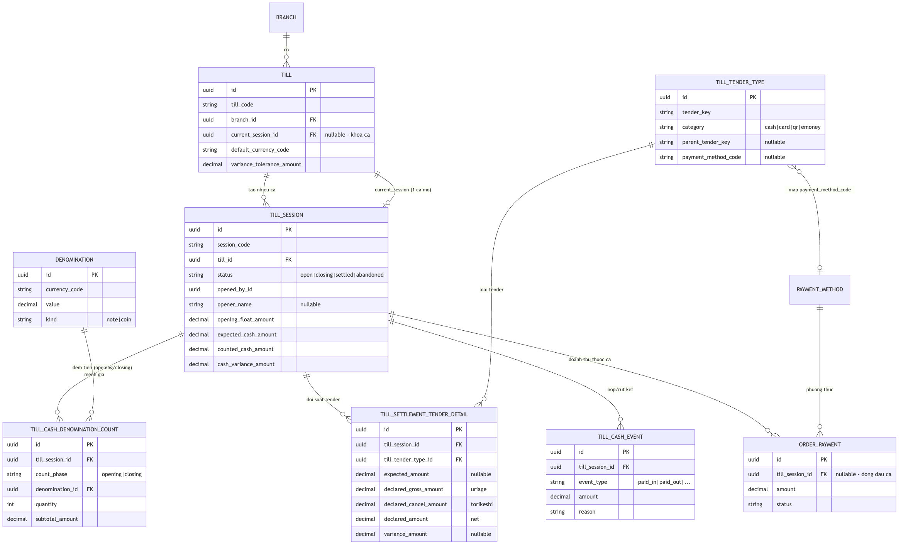
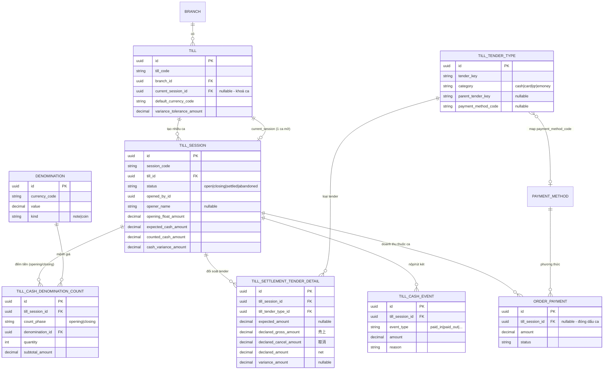

# Kế hoạch tính năng: Mở ca & Kết ca (Cashier Shift) — POS

> **Mã kế hoạch:** plan-030
> **Phạm vi:** pos-web (giao diện) + backend Laravel (API/DB) + Omnify schema
> **Chuẩn tham chiếu:** ARTS ODM 7.3 — Tender Control & Settlement (Hiệp hội Chuẩn Công nghệ Bán lẻ / OMG)
> **Trạng thái:** Bản thiết kế (chờ duyệt — chưa viết code)
> **Issue theo dõi:** godx-jp/godx-tempo #345

---

## Mục lục

1. [Tổng quan & mục tiêu](#1-tổng-quan--mục-tiêu)
2. [Tác dụng — vì sao cần tính năng này](#2-tác-dụng--vì-sao-cần-tính-năng-này)
3. [Phạm vi công việc](#3-phạm-vi-công-việc)
4. [Kiến trúc tổng thể](#4-kiến-trúc-tổng-thể)
5. [Mô hình dữ liệu (DB)](#5-mô-hình-dữ-liệu-db)
6. [Sơ đồ quan hệ thực thể (ERD)](#6-sơ-đồ-quan-hệ-thực-thể-erd)
7. [Vòng đời ca (state machine)](#7-vòng-đời-ca-state-machine)
8. [Logic đối soát (công thức tính)](#8-logic-đối-soát-công-thức-tính)
9. [API](#9-api)
10. [Giao diện (UI)](#10-giao-diện-ui)
11. [Phân quyền](#11-phân-quyền)
12. [Các quyết định thiết kế chính](#12-các-quyết-định-thiết-kế-chính)
13. [Kế hoạch triển khai](#13-kế-hoạch-triển-khai)
14. [Rủi ro & giảm thiểu](#14-rủi-ro--giảm-thiểu)
15. [Tiêu chí hoàn thành](#15-tiêu-chí-hoàn-thành)

---

## 1. Tổng quan & mục tiêu

Bổ sung cho **pos-web** quy trình **mở ca / kết ca** hoàn chỉnh:

- **Mở ca:** thu ngân đếm **tiền mặt đầu ca theo từng mệnh giá** (đa tiền tệ: JPY/VND/USD/EUR), hệ thống tự tính số dư đầu ca làm điểm gốc đối chiếu.
- **Kết ca:** thu ngân **đối chiếu 3 nguồn số liệu**:
  1. Doanh thu POS hệ thống ghi nhận,
  2. Tiền mặt **thực đếm** trong két,
  3. Số liệu **in ra từ máy Stera** (biên lai 日計 — daily total: tín dụng / QR / tiền điện tử theo từng brand),

  → cho ra báo cáo **chênh lệch (over/short) theo từng phương thức**.

- **Khoá nghiệp vụ:** backend **chặn cứng** việc tạo đơn / thanh toán khi chưa mở ca → mọi doanh thu thuộc đúng một ca.

Mô hình dữ liệu bám theo chuẩn quốc tế **ARTS ODM 7.3** (Till → TillSession → CashDenominationCount → SettlementTenderDetail → CashEvent) thay vì tự nghĩ cấu trúc tạm.

**Mục tiêu đo lường được:**

| # | Tiêu chí |
|---|----------|
| 1 | Không mở ca thì không vào được màn bán hàng; `POST /pos/orders` trả 409 khi chưa có ca mở |
| 2 | Mở ca lưu được số dư theo mệnh giá; số dư = Σ(mệnh giá × số tờ) |
| 3 | Mọi payment trong ca mang `till_session_id` của ca đó |
| 4 | Kết ca hiện đủ: tiền mặt kỳ vọng + kỳ vọng từng tender; nhập tiền thực đếm + số từ bill Stera; tự ra chênh lệch có dấu |
| 5 | Kết ca → ca chuyển `settled`, ghi đếm cuối ca + chi tiết đối soát, mở khoá till cho ca sau |
| 6 | Lệch quá ngưỡng bắt buộc nhập lý do mới cho kết ca |

---

## 2. Tác dụng — vì sao cần tính năng này

| Vấn đề hiện tại | Tính năng giải quyết |
|-----------------|----------------------|
| pos-web **không có khái niệm ca** — không biết tiền đầu ca, không cash-up cuối ngày | Quy trình mở/kết ca chuẩn, có số dư đầu ca và đối soát cuối ca |
| Không đối chiếu được POS vs máy Stera → **giao dịch sót/trùng** (timeout, máy restart) không bị phát hiện | Nhập số từ bill Stera theo từng brand, so với POS → lộ ngay chênh lệch |
| Không đếm két → **không phát hiện thừa/thiếu tiền mặt** (trả nhầm, mất cắp) | Đếm tiền theo mệnh giá đầu & cuối ca → over/short tiền mặt |
| Doanh thu không gắn với người/ca cụ thể → **khó truy trách nhiệm** | Mỗi payment gắn `till_session_id` + người mở/kết ca |
| Tiền vào/ra giữa ca (入金/出金) không được ghi | Bảng sự kiện có audit (ai, bao nhiêu, lý do, lúc nào) |

**Giá trị tổng quát:** kiểm soát tiền mặt, đối soát thiết bị thanh toán, quy trách nhiệm theo ca, dữ liệu chuẩn để báo cáo & kiểm toán — đúng thông lệ vận hành cửa hàng tại Nhật.

---

## 3. Phạm vi công việc

### Trong phạm vi (in scope)

**Schema (Omnify YAML, domain mới `Till`):** 7 bảng + 5 enum + sửa `OrderPayment`.

**Backend (`/api/v1/pos/till/*`):** mở ca, kết ca, lưu nháp, huỷ ca, ghi sự kiện tiền mặt; các API đọc (ca hiện tại, master mệnh giá, danh sách tender, dữ liệu đối soát tính sẵn); middleware chặn cứng đơn/thanh toán khi chưa mở ca; seeder mệnh giá + tender.

**pos-web:** màn `/pos/shift/open`, `/pos/shift/close`, dialog nộp/rút két, dialog huỷ ca, cổng chặn (gate) trên `/pos`, in báo cáo Z (best-effort qua workstation), i18n ja/en/vi.

### Ngoài phạm vi (out of scope)

- Handler in phía workstation Go (`/print/shift-report`) — pos-web gọi best-effort, tự tắt êm khi chưa cấu hình.
- Multi-terminal trên cùng branch (v1 dùng 1 till `MAIN`/branch; cột `device_id` để dành).
- Đếm nhiều loại tiền tệ cùng lúc trong một ca (v1: 1 currency/ca, mặc định JPY; schema đã sẵn `currency_code` để mở rộng sau).
- Mở lại ca đã settled (chỉ có `abandon` trước khi settle).
- Màn admin CRUD mệnh giá / tender (đều seed sẵn).
- Reconciliation két an toàn / nộp ngân hàng (ARTS Safe/ExternalDepository).
- Bàn giao ca (số dư cuối ca A → đầu ca B tự điền).

---

## 4. Kiến trúc tổng thể

```
pos-web (/pos/shift/open, /pos/shift/close, dialog nộp-rút/huỷ ca)
   │  TanStack Query hooks  →  Cloud /api/v1/pos/till/*  (header X-Shop-Slug, auth SSO)
   ▼
ResolvePosShop ─→ TillSessionController (controller "mỏng": authorize · delegate · respond)
                       │
                       ▼
                 TillSessionService  (DB::transaction + lockForUpdate trên Till)
                   ├─ open()      → TillSession(open) + đếm tiền đầu ca + set con trỏ ca
                   ├─ cashEvent() → ghi 入金/出金
                   ├─ reconcile() → đọc OrderPayment theo session → kỳ vọng tiền/tender
                   ├─ saveDraft() → trạng thái closing, lưu nháp
                   ├─ close()     → đếm cuối ca + chi tiết đối soát + chênh lệch → settled
                   └─ abandon()   → huỷ ca mở nhầm (khi chưa có payment)

POST /pos/orders, /pos/payments
   └─ ResolveOpenTillSession (middleware) → 409 NO_OPEN_SHIFT nếu till chưa có ca mở
        OrderPaymentService::create() đóng dấu OrderPayment.till_session_id
```

- **Đường đi dữ liệu:** trình duyệt tablet → pos-web → Cloud (các API till là cloud-only ở v1).
- **In ấn:** sau khi mở/kết ca thành công, pos-web gọi `workstationPrintService.printShiftReport()` (best-effort).

---

## 5. Mô hình dữ liệu (DB)

7 bảng đối tượng nằm trong domain mới `schemas/Backend/Till/` + 5 enum + 1 sửa đổi `OrderPayment`. Tất cả sinh ra từ YAML qua `npm run omnify:gen` (không viết migration tay).

### Ánh xạ thực thể ↔ ARTS ODM

| Bảng dự án | ARTS ODM 7.3 | Vai trò |
|------------|--------------|---------|
| `Till` | `Till` / `TenderRepository` | Ngăn kéo tiền; giữ con trỏ ca đang mở (khoá "1 ca mở/till") |
| `TillSession` | `WorkstationPeriodStart/End` + operating period | Một chu kỳ mở→kết = một ca |
| `Denomination` | `Denomination` | Master mệnh giá (value, note/coin, currency) |
| `TillCashDenominationCount` | `TillTenderCashDenominationCount` | Đếm tiền theo mệnh giá (đầu & cuối ca) |
| `TillTenderType` | `Tender` | Master tender đối soát (cấu hình theo branch) |
| `TillSettlementTenderDetail` | `TillSettlementTenderDetail` | Đối soát từng tender lúc kết: kỳ vọng vs khai báo vs chênh lệch |
| `TillCashEvent` | `TenderControlTransaction` | Nộp/rút két giữa ca (có audit) |

### 5.1. `tills` — Ngăn kéo tiền

| Cột | Kiểu | Ghi chú |
|-----|------|---------|
| id | Uuid | PK |
| till_code | String(50) | VD `MAIN`; duy nhất theo branch |
| branch_id / organization_id / brand_id | Uuid (assoc) | Phạm vi |
| device_id | Uuid (assoc, **nullable**) | Để dành multi-terminal (v1 không dùng) |
| default_currency_code | String(3) | Mặc định `JPY` |
| variance_tolerance_amount | Decimal(15,2) | Ngưỡng cho phép lệch, mặc định 0 |
| current_session_id | Uuid (assoc, **nullable**) | Con trỏ ca đang mở; `null` = không có ca → chặn bán |
| is_active | Boolean | Mặc định true |
| timestamps, softDelete | | |

**Chỉ mục:** unique `(branch_id, till_code)`.

### 5.2. `till_sessions` — Ca (phiên mở→kết)

| Cột | Kiểu | Ghi chú |
|-----|------|---------|
| id | Uuid | PK |
| session_code | String(50) | Auto `SHIFT-YYYYMMDD-NNN`, unique |
| till_id / branch_id / organization_id / brand_id | Uuid (assoc) | |
| business_date | Date | Ngày vận hành |
| status | Enum `TillSessionStatus` | `open` → `closing` → `settled`, hoặc → `abandoned` |
| opened_by_id / closed_by_id | Uuid (soft FK SSO) | Ai mở / ai kết |
| opener_name | String(255), **nullable** | Tên người mở "thay" (option "Khác…"); null ⇒ dùng `opened_by_id` |
| opened_at / closed_at / abandoned_at | Timestamp | |
| abandon_reason | Text, nullable | Lý do huỷ |
| default_currency_code | String(3) | 1 currency/ca (v1) |
| opening_float_amount | Decimal(15,2) | Σ đếm đầu ca (cache) |
| expected_cash_amount | Decimal(15,2), nullable | Tính lúc kết |
| counted_cash_amount | Decimal(15,2), nullable | Thực đếm cuối ca |
| cash_variance_amount | Decimal(15,2), nullable | = counted − expected |
| opening_note / closing_note | Text, nullable | |
| timestamps | | **Không** soft delete (audit vĩnh viễn) |

**Chỉ mục:** unique `session_code`; `(branch_id, status)`; `(till_id, status)`; `business_date`.

### 5.3. `denominations` — Master mệnh giá

| Cột | Kiểu | Ghi chú |
|-----|------|---------|
| id | Uuid | PK |
| currency_code | String(3) | JPY/VND/USD/EUR |
| value | Decimal(15,2) | VD 10000, 0.25, 0.01 |
| kind | Enum `DenominationKind` | `note` (giấy) / `coin` (xu) |
| label | String(50), nullable | VD "¥10,000", "25¢ quarter" |
| sort_order | Int | Sắp xếp giảm dần |
| is_active | Boolean | |
| organization_id | Uuid (assoc, **nullable**) | null = bộ seed toàn cục |

**Chỉ mục:** unique `(organization_id, currency_code, value, kind)`.

**Bộ seed (lấy từ prototype `shift-open.html`):**

- **JPY** — giấy: 10000, 5000, 2000, 1000; xu: 500, 100, 50, 10, 5, 1
- **VND** — giấy: 500000, 200000, 100000, 50000, 20000, 10000, 5000, 2000, 1000, 500; xu: 200, 100
- **USD** — giấy: 100, 50, 20, 10, 5, 2, 1; xu: 1, 0.5, 0.25, 0.1, 0.05, 0.01
- **EUR** — giấy: 500, 200, 100, 50, 20, 10, 5; xu: 2, 1, 0.5, 0.2, 0.1, 0.05, 0.02, 0.01

### 5.4. `till_cash_denomination_counts` — Đếm tiền theo mệnh giá

| Cột | Kiểu | Ghi chú |
|-----|------|---------|
| id | Uuid | PK |
| till_session_id | Uuid (assoc, CASCADE) | Ca cha |
| count_phase | Enum `TillCountPhase` | `opening` / `closing` |
| denomination_id | Uuid (assoc, RESTRICT) | FK master |
| currency_code | String(3) | **Snapshot** |
| denomination_value | Decimal(15,2) | **Snapshot** |
| denomination_kind | Enum `DenominationKind` | **Snapshot** |
| quantity | Int | **Số tờ/xu nhập tay** |
| subtotal_amount | Decimal(15,2) | = value × quantity (server tính) |
| timestamps | | |

**Chỉ mục:** `(till_session_id, count_phase)`. *Snapshot để lịch sử ca không sai khi master mệnh giá đổi.*

### 5.5. `till_tender_types` — Master tender đối soát

| Cột | Kiểu | Ghi chú |
|-----|------|---------|
| id | Uuid | PK |
| tender_key | String(50) | `cash`, `credit`, `rakuten_pay`, `paypay`, … |
| name | String(255), **translatable** | Tên hiển thị ja/en/vi |
| category | Enum `TillTenderCategory` | `cash` / `card` / `qr` / `emoney` |
| parent_tender_key | String(50), nullable | Gom sub-brand vào nhóm (9 brand QR → `qr`) |
| currency_code | String(3) | Mặc định JPY |
| payment_method_code | String(50), nullable | Map sang `PaymentMethod.code` để tính kỳ vọng; null nếu không có nguồn POS 1:1 |
| is_expected_anchor | Boolean | Tender mang kỳ vọng POS ở cấp category |
| requires_terminal_total | Boolean | Có ô nhập 売上合計 (tổng máy in) |
| sort_order | Int | |
| is_active | Boolean | |
| branch_id | Uuid (assoc, nullable) | null = toàn org |
| organization_id | Uuid (assoc) | |

**Chỉ mục:** unique `(organization_id, branch_id, tender_key)`.

**Bộ seed tender:**

| tender_key | category | Tên (ja) |
|------------|----------|----------|
| cash | cash | 現金 |
| credit | card | クレジット |
| rakuten_pay | qr | 楽天ペイ |
| paypay | qr | PayPay |
| d_barai | qr | d払い |
| au_pay | qr | au PAY |
| merpay | qr | メルペイ |
| ginko_pay | qr | 銀行Pay |
| wechat_pay | qr | WeChatPay |
| alipay | qr | Alipay |
| unionpay | qr | 銀聯 |
| id | emoney | iD |
| ic | emoney | 交通系IC (Suica/PASMO) |
| edy | emoney | 楽天Edy |
| waon | emoney | WAON |
| nanaco | emoney | nanaco |
| quicpay | emoney | QUICPay |

### 5.6. `till_settlement_tender_details` — Đối soát từng tender lúc kết

| Cột | Kiểu | Ghi chú |
|-----|------|---------|
| id | Uuid | PK |
| till_session_id | Uuid (assoc, CASCADE) | |
| till_tender_type_id | Uuid (assoc, RESTRICT) | |
| tender_key / category / currency_code | snapshot | |
| expected_amount | Decimal(15,2), nullable | Kỳ vọng POS (per-row cho cash/credit; null cho sub-brand) |
| declared_gross_amount | Decimal(15,2) | **売上** — đọc từ bill Stera |
| declared_cancel_amount | Decimal(15,2) | **取消** — đọc từ bill |
| declared_amount | Decimal(15,2) | **net = 売上 − 取消** (server tính) |
| terminal_batch_total | Decimal(15,2), nullable | 売上合計 in trên máy |
| variance_amount | Decimal(15,2), nullable | = net − expected (khi có expected) |
| variance_reason | Text, nullable | Bắt buộc khi |lệch| > ngưỡng |
| timestamps | | Không soft delete |

**Chỉ mục:** unique `(till_session_id, tender_key)`.

### 5.7. `till_cash_events` — Nộp/rút két giữa ca

| Cột | Kiểu | Ghi chú |
|-----|------|---------|
| id | Uuid | PK |
| till_session_id | Uuid (assoc, CASCADE) | |
| event_type | Enum `TillCashEventType` | `paid_in` (入金) / `paid_out` (出金) / `loan_from_safe` / `pickup_to_safe` |
| amount | Decimal(15,2) | Luôn dương; dấu theo loại |
| currency_code | String(3) | Mặc định JPY |
| reason | Text, nullable | Bắt buộc khi ghi |
| performed_by_id | Uuid (soft FK) | Người thực hiện |
| occurred_at | Timestamp | |
| reference_no | String(100), nullable | |
| timestamps | | Không soft delete |

**Chỉ mục:** `(till_session_id, occurred_at)`.

### 5.8. Sửa `order_payments` (bảng có sẵn)

Thêm `till_session_id` (assoc → TillSession, **nullable**, `onDelete: SET NULL`) + chỉ mục `[till_session_id]`. Được đóng dấu lúc tạo payment khi till đang có ca mở. **Đây là cơ chế "chia doanh thu theo ca".**

### 5.9. Enum

| Enum | Giá trị |
|------|---------|
| `TillSessionStatus` | open · closing · settled · abandoned |
| `TillCountPhase` | opening · closing |
| `TillCashEventType` | paid_in · paid_out · loan_from_safe · pickup_to_safe |
| `TillTenderCategory` | cash · card · qr · emoney |
| `DenominationKind` | note · coin |

---

## 6. Sơ đồ quan hệ thực thể (ERD)



> *Hình trên render từ mã Mermaid ở mục 6.1. Nếu convert docx mà ảnh không hiện, kiểm tra đường dẫn `docs-assets/plan-030-erd.png` (đặt cạnh file md này).*

### 6.1. Mermaid (mã nguồn của sơ đồ trên)



### 6.2. ASCII (luôn render được khi convert docx)

```
                         BRANCH
                            │ 1
                            │ N
                          TILL ──current_session──┐ (0..1 ca mở)
                            │ 1                    │
                            │ N                    ▼
                       TILL_SESSION ◄──────────────┘
        ┌──────────────┬────┴───────┬───────────────┬──────────────┐
        │ 1            │ 1          │ 1             │ 1            │ 1
        ▼ N            ▼ N          ▼ N             ▼ N            ▼ N
  CASH_DENOM_COUNT  SETTLEMENT_   CASH_EVENT    ORDER_PAYMENT   (note/closing
   (opening/        TENDER_DETAIL (入金/出金)   (đóng dấu ca)    fields trên
    closing)             │                                       session)
        ▲ N              ▲ N                          ▲ N
        │ 1              │ 1                          │ 1
   DENOMINATION    TILL_TENDER_TYPE             PAYMENT_METHOD
   (master mệnh     (master tender) ──map payment_method_code──┘
    giá/currency)
```

### 6.3. Bảng quan hệ

| Cha | Con | Quan hệ | onDelete |
|-----|-----|---------|----------|
| Branch | Till | 1–N | — |
| Till | TillSession | 1–N (lịch sử) | — |
| Till | TillSession (current_session) | 1–0..1 (ca mở) | SET NULL |
| TillSession | TillCashDenominationCount | 1–N | CASCADE |
| TillSession | TillSettlementTenderDetail | 1–N | CASCADE |
| TillSession | TillCashEvent | 1–N | CASCADE |
| TillSession | OrderPayment | 1–N (đóng dấu) | SET NULL |
| Denomination | TillCashDenominationCount | 1–N | RESTRICT |
| TillTenderType | TillSettlementTenderDetail | 1–N | RESTRICT |
| TillTenderType | PaymentMethod | N–0..1 (map code) | — |
| PaymentMethod | OrderPayment | 1–N | RESTRICT |

---

## 7. Vòng đời ca (state machine)

```
        POST /sessions                       POST /sessions/{id}/close
   ─────────────────────►  ┌──────┐  ──────────────────────────────►  ┌─────────┐
   (đếm tiền đầu ca)        │ open │                                   │ settled │ (khoá vĩnh viễn)
                           └──┬───┘   PATCH …/draft   ┌─────────┐      └─────────┘
                              │      ────────────────►│ closing │── close ─────────┘
                              │      (lưu nháp kết ca) └─────────┘
                              │ POST …/abandon
                              ▼ (huỷ ca mở nhầm, CHƯA có payment)
                        ┌───────────┐
                        │ abandoned │
                        └───────────┘
```

| Chuyển trạng thái | Endpoint | Điều kiện | Hệ quả |
|-------------------|----------|-----------|--------|
| ∅ → open | POST /sessions | till chưa có ca mở | tạo ca + đếm đầu ca, set con trỏ, tính float |
| open → closing | PATCH …/draft | đang open | lưu nháp kết ca, chưa khoá |
| open/closing → settled | POST …/close | đang open/closing | ghi đếm cuối + đối soát, tính chênh lệch, clear con trỏ, khoá |
| open/closing → abandoned | POST …/abandon | **chưa có payment** | huỷ ca, clear con trỏ, giữ đếm đầu để audit |

`settled` và `abandoned` là trạng thái cuối (không quay lại). Ca `abandoned` bị loại khỏi báo cáo doanh thu.

---

## 8. Logic đối soát (công thức tính)

Theo từng currency (v1: JPY):

```
opening_float        = Σ (denomination.value × quantity)          [phase = opening]
counted_cash         = Σ (denomination.value × quantity)          [phase = closing]

expected_cash        = opening_float + cash_sales + Σ paid_in − Σ paid_out
cash_variance        = counted_cash − expected_cash

declared_net(tender) = declared_gross (売上) − declared_cancel (取消)
tender_variance      = declared_net − expected_amount

# QR / e-money: POS chỉ có tổng → đối soát ở cấp NHÓM (category)
category_expected[c] = Σ OrderPayment.amount (succeeded) theo payment_method map vào category c
category_variance[c] = Σ declared_net(các tender trong c) − category_expected[c]
```

- `cash_sales` = Σ payment tiền mặt (succeeded) đóng dấu ca này (đã trừ tiền thừa — dùng `amount`, không dùng `tendered`).
- Quy ước dấu: **dương = thừa (over)**, **âm = thiếu (short)**.
- Tiền tip: `tip_amount` **không** tính vào kỳ vọng két (theo BR-P03), chỉ `amount` vào két.
- Payment **pending** (thẻ chưa confirm) lúc kết → không nằm trong expected (chỉ tính `succeeded`) → hiện thành chênh lệch Stera (đúng ý đồ đối soát).

---

## 9. API

Tất cả dưới `/api/v1/pos/till/*`, auth SSO + header `X-Shop-Slug` (`ResolvePosShop`).

| # | Method | Path | Tác dụng |
|---|--------|------|----------|
| 1 | GET | `/pos/till/current` | Till + ca đang mở (hoặc null → FE bắt mở ca) |
| 2 | GET | `/pos/till/denominations?currency=JPY` | Master mệnh giá cho UI đếm |
| 3 | GET | `/pos/till/tender-types` | Danh sách tender đối soát của branch |
| 4 | POST | `/pos/till/sessions` | **Mở ca** (đếm tiền đầu ca) |
| 5 | GET | `/pos/till/sessions/{id}` | Chi tiết ca |
| 6 | GET | `/pos/till/sessions/{id}/reconciliation` | Dữ liệu kết ca tính sẵn (doanh thu + kỳ vọng) |
| 7 | POST | `/pos/till/sessions/{id}/cash-events` | Ghi 入金/出金 |
| 8 | PATCH | `/pos/till/sessions/{id}/draft` | Lưu nháp kết ca |
| 9 | POST | `/pos/till/sessions/{id}/close` | **Kết ca** (settle) |
| 10 | POST | `/pos/till/sessions/{id}/abandon` | Huỷ ca mở nhầm |

**Guard (không phải endpoint mới):** middleware `ResolveOpenTillSession` gắn vào `POST /pos/orders` + `POST /pos/payments` → 409 `NO_OPEN_SHIFT` khi chưa mở ca.

**Mã lỗi tiêu biểu:** 409 `SHIFT_ALREADY_OPEN`, `SHIFT_NOT_OPEN`, `SHIFT_HAS_PAYMENTS`, `NO_OPEN_SHIFT`; 422 `VARIANCE_REASON_REQUIRED` + lỗi validation.

**Body `POST …/close`:**

```jsonc
{
  "closing_counts": [{ "denomination_id": "…", "quantity": 12 }],
  "tender_details": [
    { "tender_key": "credit", "gross_amount": 18310, "cancel_amount": 0 },
    { "tender_key": "rakuten_pay", "gross_amount": 1370, "cancel_amount": 0 },
    { "tender_key": "paypay", "gross_amount": 7850, "cancel_amount": 0 }
    // … 9 brand QR + e-money
  ],
  "closing_note": "…"
}
```

---

## 10. Giao diện (UI)

3 surface mới trên pos-web (`@godxjp/ui`). Bám sát 2 prototype `shift-open.html` / `shift-close.html`.

### 10.1. Màn Mở ca — `/pos/shift/open`

**Bố cục (1 cột, tablet):**

```
┌─ Thông tin ca / シフト情報 ──────────────────────────┐
│ Cửa hàng · Thiết bị · Người mở ca [Select ▾ + "Khác…"]│
└──────────────────────────────────────────────────────┘
┌─ Đếm tiền theo mệnh giá / 金種別カウント   [Currency ▾]┐
│ Tiền giấy / 紙幣                                       │
│   ¥10,000  [−] [ 15 ] [+] 枚              150,000      │
│   ¥5,000   [−] [  3 ] [+] 枚               15,000      │
│   …                                                    │
│ Tiền xu / 硬貨                                         │
│   ¥500     [−] [  2 ] [+] 枚                1,000      │
│   …                                                    │
├──────────────────────────────────────────────────────┤
│ Số dư tiền mặt đầu ca / 開始現金残高     ¥ 171,206     │ ← Σ live
│ Ghi chú [textarea]                                     │
└──────────────────────────────────────────────────────┘
        [Huỷ]            [Mở ca & In báo cáo]   ← sticky footer
```

**Component (`@godxjp/ui`):** Card, Select (currency + operator + ô "Khác…" reveal Input cho `opener_name`), Table mệnh giá, Input (qty, `inputmode="numeric"`), NumberStepper (ghép từ Button), Textarea, Alert, Badge.

**Tương tác:** stepper ± & nhập số → cập nhật subtotal + tổng **live** (tabular-nums); đổi currency reload bộ mệnh giá (confirm nếu đã nhập); submit → mở ca → về `/pos`; in báo cáo best-effort.

**Best-practice (form-UX research):** mệnh giá lớn→nhỏ, nhóm giấy/xu; tap target ≥44–48px; autofocus dòng đầu; Enter chuyển dòng; aria-label theo mệnh giá; aria-live cho tổng.

### 10.2. Màn Kết ca — `/pos/shift/close`

**Bố cục (2 cột):**

```
┌─────────────────── CỘT CHÍNH (~65%) ───────────────────┐  ┌── CỘT BÊN (sticky ~35%) ──┐
│ A. Báo cáo mở quầy (read-only): float, người mở, giờ   │  │ Tổng kết đối chiếu        │
│ B. Dữ liệu POS: 税込/税抜/消費税/割引/現金/Stera/合計   │  │  POS 売上(税込/税抜/税)   │
│ C. Đối chiếu tiền mặt:                                  │  │  Chênh lệch tiền mặt  ¥0  │
│    kỳ vọng (=float+cash−出金+入金) vs THỰC ĐẾM vs chênh │  │  Chênh lệch Stera  −¥…   │
│ D. Đối chiếu Stera (grid theo nhóm):                    │  │  [⚠ cảnh báo nếu lệch]   │
│    クレジット   売上[18,310] 取消[0] net18,310 POS… ⚠  │  │                           │
│    ▸ QR決済 (nhóm)                                      │  │  [Xác nhận kết ca & In]  │
│        楽天ペイ 売上[1,370] 取消[0] net 1,370           │  │  [Lưu nháp]              │
│        PayPay   売上[7,850] 取消[0] net 7,850           │  │  [In thử]               │
│        … 9 brand → QR小計 net vs POS  ⚠                 │  └───────────────────────────┘
│ E. 電子マネー: WAON/QUICPay/iD/IC/Edy/nanaco (売上/取消)│
│ F. Ghi chú kết ca [textarea]                            │
└─────────────────────────────────────────────────────────┘
```

**Component:** Card, Table/Grid (reconcile-grid gom theo category, 2 ô nhập 売上/取消 + net auto), Input, Textarea, Badge (màu chênh lệch), Alert (cảnh báo out-of-tolerance), Dialog (xác nhận khoá ca), Skeleton.

**Hiển thị chênh lệch:** dấu `net − expected`; 0 = trung tính/xanh, thiếu (<0) = đỏ, thừa (>0) = vàng; **màu + icon + nhãn** (không chỉ dùng màu). Dòng lệch quá ngưỡng hiện ô lý do bắt buộc.

**Tương tác:** gõ số live-update chênh lệch + sidebar; "Lưu nháp" → PATCH draft; "Xác nhận" → Dialog → POST close → về `/pos/shift/open`; nút disabled tới khi đủ điều kiện.

### 10.3. Dialog Nộp/Rút két (入金/出金) — trên `/pos`

Modal từ menu POS (chỉ hiện khi đang có ca): chọn loại (paid_in/paid_out), số tiền (>0), lý do (bắt buộc) → `POST …/cash-events` → invalidate dữ liệu reconciliation.

### 10.4. Hành động Huỷ ca (abandon)

Nút "Huỷ ca / ca mở nhầm" → Dialog xác nhận + lý do → `POST …/abandon` → về màn mở ca. Ẩn khi ca đã có payment (server chặn 409 `SHIFT_HAS_PAYMENTS`).

### 10.5. Cổng chặn (gate)

Vào `/pos` mà `current.open_session === null` → tự chuyển `/pos/shift/open`. Menu POS có "Kết ca", "入金/出金", "Huỷ ca" (chỉ khi có ca mở).

---

## 11. Phân quyền

| Hành động | staff (thu ngân) | org-manager | org-admin |
|-----------|------------------|-------------|-----------|
| Xem ca hiện tại / mở ca | ✅ (branch mình) | ✅ | ✅ |
| Ghi nộp/rút két | ✅ (ca mở) | ✅ | ✅ |
| Lưu nháp / Kết ca | ✅ (ca mở) | ✅ | ✅ |
| Huỷ ca (chưa có payment) | ✅ (ca mở) | ✅ | ✅ |
| Xem ca đã settled | ✅ (branch mình) | ✅ (org) | ✅ (org) |
| Mở lại ca đã settled | ❌ | ❌ | ❌ |

- Scope theo `shop_id` (từ `X-Shop-Slug`); thu ngân branch B **không** truy cập được ca branch A (403/404).
- Khoá bán hàng khi chưa mở ca là ràng buộc **vận hành**, áp cho mọi vai trò.

---

## 12. Các quyết định thiết kế chính

| # | Quyết định | Lý do |
|---|------------|-------|
| 1 | Mô hình full ARTS (7 bảng) thay vì JSON/tối giản | Query/report/audit theo từng mệnh giá & tender; bám chuẩn |
| 2 | Đóng dấu `till_session_id` lên payment | Chia doanh thu chính xác, tránh cắt theo giờ (lỗi biên/timezone) |
| 3 | Backend chặn cứng (409 `NO_OPEN_SHIFT`) | Mọi doanh thu thuộc đúng 1 ca |
| 4 | QR nhập theo 9 sub-brand + tách 売上/取消; kỳ vọng ở cấp category | Khớp 100% bill Stera, report theo brand; POS chỉ có tổng nên kỳ vọng để cấp nhóm |
| 5 | Till theo (branch, `MAIN`) ở v1 | pos-web auth SSO, chưa có device token; multi-terminal để sau |
| 6 | 1 currency/ca (mặc định JPY), schema sẵn multi-currency | Khớp vận hành JP + prototype; mở rộng sau chỉ sửa UI |

---

## 13. Kế hoạch triển khai

| Phase | Nội dung |
|-------|----------|
| 1. Schema | 5 enum + 7 bảng `schemas/Backend/Till/` + thêm `till_session` vào OrderPayment → `omnify:gen` → migrate |
| 2. Models | casts/scopes/accessors trên sibling model |
| 3. Services | `TillSessionService`: open / reconcile / cashEvent / saveDraft / close / abandon (transaction + lock); đóng dấu `till_session_id`; fix bug `PosRevenueService.byPaymentMethod` (`succeeded`) |
| 4. Requests/Policies/Middleware | Form requests; `TillSessionPolicy`; `ResolveOpenTillSession` |
| 5. Controllers/Routes | Controllers "mỏng" + resources + 10 routes |
| 6. Seeders | `DenominationSeeder` (JPY/VND/USD/EUR) + `TillTenderTypeSeeder` (9 QR + e-money) + `TillSeeder` (MAIN/branch) |
| 7. Frontend | hooks TanStack Query; màn open/close; dialog cash-event/abandon; gate; print best-effort; i18n |
| 8. Tests | Factories + Pest (Feature/Unit) + pos-web Browser/vitest (~67 scenario) |
| 9. Format | `pint --dirty` + `pnpm lint --fix` |

---

## 14. Rủi ro & giảm thiểu

| Rủi ro | Giảm thiểu |
|--------|------------|
| pos-web LAN-first gọi nhầm workstation cho API till (404) | API till cloud-only v1; ép base URL cloud; mirror workstation là follow-up |
| Bug `PosRevenueService.byPaymentMethod` lọc sai status → rỗng | Fix `succeeded` trong plan + test hồi quy |
| Trôi số lẻ USD/EUR (xu 0.01) | Decimal(15,2); tính subtotal phía server |
| 2 tablet cùng mở 1 till | `lockForUpdate()` trên row Till + bất biến `current_session_id` |
| Sai quy ước dấu (thừa/thiếu) | Cố định ở API (`declared − expected`); test cả 2 chiều; UI màu+icon+nhãn |
| Lệch QR chỉ so được cấp nhóm | Ghi rõ: nhập đủ 9 brand để khớp bill, cảnh báo lệch ở cấp QR |

---

## 15. Tiêu chí hoàn thành

- [ ] Không mở ca → không bán được; `POST /pos/orders` trả 409.
- [ ] Mở ca lưu đếm theo mệnh giá; float = Σ(value × qty).
- [ ] Payment trong ca mang `till_session_id`.
- [ ] Kết ca hiện kỳ vọng + nhận thực đếm + số bill Stera (per brand, 売上/取消) → chênh lệch có dấu/màu.
- [ ] Kết ca settle: ghi đếm cuối + chi tiết tender, clear con trỏ till, khoá ca.
- [ ] Lệch quá ngưỡng bắt nhập lý do.
- [ ] `php artisan test --compact` xanh; pos-web `pnpm test` + `npx tsc -b` xanh.

---

*Tài liệu này tóm tắt plan-030 (`plans/plan-030/`). Nguồn chi tiết: README / DESIGN / TESTS / TASKS / NOTES trong thư mục plan. Prototype UI: `web/pos/shift-open.html`, `web/pos/shift-close.html`. Chuẩn tham chiếu: ARTS ODM 7.3.*
